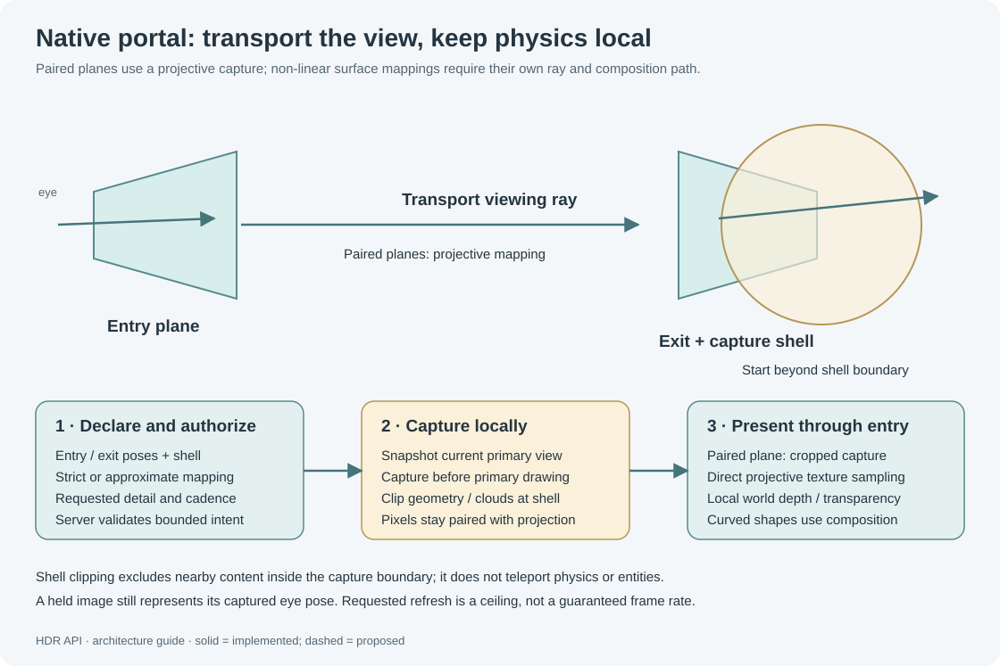

# Cameras, panoramas and visual portals

Camera imagery and portals are optional viewer-local renderer features. The server/PB declares identity, shape and requested quality; each viewing client validates access, captures and presents its own imagery. No video stream is replicated by HDR. CamScan retains scanning, depth observations and reconstruction responsibility.

## Direct camera panorama

Use [DirectCameraSphereDemo.cs](../../Examples/DirectCameraSphereDemo.cs), built as `artifacts/DirectCameraSphere_v14.pb.cs`. Name a Console/Projector **HDR Display**. The demo chooses one to six camera blocks on the PB's construct: the separate 360 Camera block types first, otherwise cameras whose names start with **HDR Camera**. Its “no LCD buffers” output means direct capture even if your cameras happen to retain old “CameraLCD Video” names.

The direct path needs HDR Client Renderer on the viewer. It does **not** need CameraLCD, a physical LCD feed or Camera360's capture plugin. Each selected physical camera supplies one forward perspective view; a Camera360 block does not magically turn that one direct view into all directions. Point the cameras to cover the directions required.

```csharp
H("target", "HDR Display");
var caps = (VRage.MyTuple<string,string,int>)H("capabilities");
if ((caps.Item3 & 16) != 0) H("volume", false);
H("range", 0);
H("screen", "panorama", MatrixD.CreateTranslation(0, 4, 0), 6, 3);
H("screen-surface", "sphere", 3, Math.PI*2, Math.PI, "inside");
H("screen-mapping", "angular");
H("screen-aspect", "stretch");
H("screen-resolution", 2048, 1024);
H("screen-refresh", 30);
H("screen-panorama", 105, 8, 1.15, 1024);
H("screen-camera-quality", "normal");
// Replace IDs with live IMyCameraBlock.EntityId values, CSV, maximum six.
H("screen-source", "camera-panorama", "cameraId1,cameraId2");
H("screen-two-sided", true, 1, .35);
```

The source ID is a comma-separated list of **numeric entity IDs**, not camera names or literal placeholders. The plugin takes the current physical optical pose and uses its forward/up basis automatically. Entity list order does not encode direction. The example creates this CSV from actual discovered cameras.

| Command | Arguments / result |
|---|---|
| `screen-panorama` | FOV degrees 60–120, feather degrees 0–25, saturation 0–2, capture ceiling 256/512/1024/2048 |
| `screen-panorama-settings` | `MyTuple<double,double,double,int>` FOV, feather, saturation, capture size |
| `screen-camera-quality` | `normal` (default) or `lite` |
| `screen-camera-quality-settings` | Selected profile string |

The default declaration is 105° square FOV, 8° feather, saturation 1.15 and 1024 capture ceiling. The panorama is bounded to 2048×1024. A larger PB screen request cannot override this native provider's output bound. Screens sharing an exact source for the same caller must agree on capture settings/profile.

Overlapping views blend in linear RGB using angular edge weights; valid camera RGB is treated as covered imagery even when native source alpha is zero. Unknown directions remain RGBA zero. Set a grey screen background if you prefer visible gaps. Screen/side opacity is applied after composition. Near objects retain parallax when cameras have different origins: orientation and FOV align rays, but do not determine distance along those rays. This renderer does not reconstruct a textured 3D map from camera colors.

### Visibility and local detail

Projected source demand uses current screen occupation, camera-facing side, frustum and optional conservative display-occlusion evidence. A 16×16 density map in **each source camera's UV space** guides cropped tiles. A bounded density-gradient/benefit quadtree can give different portions of one camera different sampling density. It is not just one total pixel count per camera.

The map can omit cameras that contribute no current visible rays, while unioning other screens' demand. Unknown evidence is conservative; pending GPU occlusion results keep work active. Tiles of one capture batch share an optical pose and publish as a complete batch, avoiding mixed partial-pose images. Local leaf/pass/pixel settings still bound this plan. See [performance](Performance-and-Troubleshooting.md).

`normal` preserves the regular capture visual settings. `lite` explicitly disables the secondary overrides for fog, SSAO, shadows, foliage, bloom and flares. It is not enabled automatically as resolution drops. Density adaptation reduces raster work; each crop still has scene preparation/shading overhead, so total pixel counts are not a guarantee of negligible rendering cost.

## LCD texture compatibility

`screen-source("lcd-texture", sourceLcd.EntityId.ToString()+":0")` copies an already rendered local LCD texture; `:0` is surface zero. This can display CameraLCD-produced video, but it inherits that producer's camera policy and source LCD detail. The relay uses its own 1024-side/262,144-pixel output bound and cannot invent detail absent from the LCD.

The source must be live, powered, accessible and on the caller's construct. Output copies normalize video RGB onto opaque alpha; final screen transparency remains available. The separate [SphericalCameraDemo.cs](../../Examples/SphericalCameraDemo.cs) is the older LCD-buffer route. Prefer the direct camera demo for new installations.

A 360×180 equirectangular image spans an entire sphere. A hemisphere instead covers all azimuth around the optical axis with polar angle from 0° at forward to 90° at its rim. A display crop can expose only that forward hemisphere, but cropping alone does not change what the producer captured. The separate Camera360 addon's multi-view mode and HDR direct one-forward-view mode have different capture semantics.

## Native portals and capture shells



Use [PortalDemo.cs](../../Examples/PortalDemo.cs), generated as `artifacts/PortalDemo.pb.cs`. Name one Console/Projector **HDR Portal**. The maintained demo defaults to `size native` and 60 Hz requested. Its entry is 4 m above the anchor; paired exit is 30 m forward; the capture shell excludes the first 5 m around the exit.

A portal is a visual ray mapping between entry and exit surfaces. It does not teleport players, physics or game entities. Shell exclusion is real capture clipping: geometry inside the authored exit shell is omitted, rather than hidden after a normal camera screenshot. Atmosphere/cloud handling is guarded separately; unsupported coverage fails instead of silently drawing unclipped content.

| Command | Arguments after command |
|---|---|
| `screen-portal-plane` | Exit `MatrixD`, width, height, `[transport="differential", accuracy="strict"]` |
| `screen-portal-ellipsoid` | Exit `MatrixD`, `Vector3D radii`, same optional modes |
| `screen-portal-mesh` | Exit `MatrixD`, `Vector3D[] points`, indexed `int[]` triangles, `Vector2[] UV`, same optional modes |
| `screen-portal-shell` | Shell `MatrixD`, `Vector3D radii` |
| `screen-portal-settings` | `[normalScale=1, saturation=1, brightness=1]` |
| `screen-portal-transport` | `[transport="differential", accuracy="strict"]` |
| `screen-portal-exit-side` | `inside` or `outside`, ellipsoid exits |
| `screen-portal-charts` | `[entryChart=0, exitChart=0]` |
| `screen-portal-clear` | None; detach pair and its native source |

Entry is the selected projected screen. Exit/shell poses use anchor-local metres and rigid right-handed transforms. Shape commands select provider `native-portal` with the screen ID as source ID. Initial shell is a 10 m sphere at the exit until explicitly changed.

Portal output requests allow 64–4096 per axis and 1–120 Hz via `screen-resolution`/`screen-refresh`. Actual native capture is capped at 2048 per axis, selected through stable 256/512/1024/2048 buckets from physical presentation density and local budgets. A native-size request is an upper ceiling with density adaptation, not “always allocate 4096.” The demo accepts `size native`, numeric `size 64..4096`, and `rate 1..120`.

HDR Client Renderer 0.9.12 performs portal capture before primary scene culling/drawing at a certified idle boundary. Paired differential planes sample the cropped native capture directly with image and projection data from the same publication. This avoids spending a full-pane intermediate on regions outside the player's view. Curved/nonlinear mappings retain their composed-image path. Ordinary camera panoramas keep their separate capture timing.

Requested cadence below the primary frame rate intentionally holds earlier captures. A held image retains its earlier eye position, so motion can still reveal translational parallax between capture ticks. Raising requested rate cannot exceed rendered primary frames or available work. Status “view age” is a captured-frame counter difference, not measured end-to-end display latency. Live jitter/quality acceptance is still required.

### Mapping modes and bounds

`differential` transports rays through paired surface derivatives, including non-planar ellipsoid or mesh mappings. `strict` publishes only rays that fit one native perspective capture; nonrepresentable areas stay transparent. `approximate` explicitly permits shell sampling and can distort nearby objects. This is not a general exact non-Cartesian multi-origin ray tracer.

`stealth` uses coincident identical entry/exit charts and straight-through ray transport, including matching ellipsoid side. The demo's outward ellipsoid bubble replaces its interior with imagery beyond the shell. Look from outside; it does not make the enclosed entities invisible to other nonparticipating clients or alter gameplay detection.

Exit plane dimensions are .1–500 m; exit ellipsoid/shell radii .05–250 m. Exit meshes support 2048 vertices/4096 triangles within 250 m local extent; valid UVs are 0–1. Entry remains within normal 25 m display bounds. Entry ellipsoids require full angular coverage. Mesh entry currently selects one authored triangle per screen; use separate screen charts for distinct entry triangles. Analytic shapes require chart zero. Normal scale has signed magnitude 1/64–64; saturation 0–2; brightness 0–4.

Shell precision guards reject extreme radius/aspect/distance cases; a conservative band just beyond the shell can also be omitted. Environment-probe atmosphere and debug primitives are excluded in the guarded native path. Capabilities are runtime-certified, not implied by loading a DLL.

## Runtime dependencies and privacy

The normal world mod declares block-bound scenes and validates permissions; the viewer plugin supplies native textures/captures. Client capabilities may be absent even while ordinary vectors work. Third-party CameraLCD is a producer only for the LCD relay route. Camera360 is a separate block/capture addon. HDR Input Backend is an experimental input dependency and currently does not enable mouse focus; it has no role in native camera capture.

Missing optional renderer components leave these features inactive and display a bounded `Requires plugin: HDR Client Renderer (...)` message on the affected viewer. The server can still accept valid declarations; no video work is dispatched to a hidden native path. `plugin-status` reports known feature/local registration/detail, while camera/portal status reports native readiness and frame diagnostics. Do not use the server's local registration result to suppress a shared declaration: a dedicated server cannot know which clients have the plugin.

Local providers exchange bounded declarations/evidence through same-process mod messages. Those objects are not multiplayer video payloads. Native imagery stays local to each viewer. See [mod integration](Mod-Integration.md) for provider protocol and [Security.md](../../Security.md) for trust limits.
