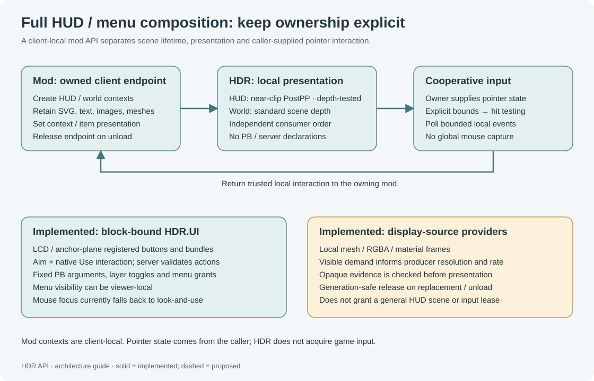

# Composition recipes

These recipes separate **content**, **layout**, **surface mapping**, **input**, **effects** and **data ownership**. See [Composition](Composition.md) for the layer contracts, actual backend limits and the complete camera-in-HTML ellipsoid demo. PB snippets use the `H` helper from [Programmable blocks](Programmable-Blocks.md#bind-the-short-endpoint); they belong inside `Main` or a setup method. Define retained artwork once and update named items when values change.


## Camera in an HTML container on an ellipsoid

Use the complete [`HtmlCameraEllipsoidDemo.cs`](../../OptionalMods/HDRHtmlFrontend/Examples/HtmlCameraEllipsoidDemo.cs), requiring **core 0.9.11 / scene 20 and HTML frontend 0.2.0**. Name a dedicated Console/Projector **`HTML Display`**, and two working physical cameras **`HDR Camera 1`** and **`HDR Camera 2`** on the PB's construct. Each viewer needs the **Client Renderer 0.9.13+** for camera capture; the interacting viewer needs it for automatic persistent pointer input.

The script creates a bounded ellipsoid patch, binds a centred 640×360 HTML canvas and attaches `camera-panorama` to `<div id='pov'></div>`. Its **Previous** and **Next** HTML buttons emit clicks; the `Update10` poll calls `attach-source` with the selected camera's positive entity ID. The handle, document, layout and controls remain in place. `demo`, `previous`, `next`, `status` and `clear` are terminal commands; status reports actual provider reasons and server publication, with no viewer/GPU acknowledgement.

```csharp
// Existing owned screen; shape and mapping were configured with HDR.Draw.
long doc = (long)Html("bind-screen", anchor, "htmlcamera",
    html, css, 640.0, 360.0, MatrixD.Identity, .005);
Html("attach-source", doc, "pov", "camera-panorama", firstCameraId);
// On a polled "click" for the Next HTML button:
Html("attach-source", doc, "pov", "camera-panorama", nextCameraId);
```

`Html` is the raw forwarding helper in the complete script and [PB API](../../OptionalMods/HDRHtmlFrontend/Docs/PB-API.md). Its projected pose locates the document centre, unlike ordinary `bind`'s top-left convention. A source region retains its content bounds and effective rectangular clip, so partial `overflow:hidden` crops provider UVs rather than stretching the remaining image. Physical camera positions supply the capture viewpoints; `screen-camera` does not invent an arbitrary native POV. Live rendering/input acceptance remains unverified.

For a native Debug sprite document, use `bind-sprites-screen` with an explicitly owned physical SCRIPT/NONE source LCD and an existing owned screen. The same five surface types can map its real native texture, but opaque RGB backing rejects partial source alpha and source overlap with later visible HTML artwork/controls. Use the [backend constraints](Composition.md#choose-a-backend-that-can-represent-the-composition) when selecting that alternative.

## An SVG status panel on an LCD

Name a physical panel `HDR LCD` and select **Content → HDR API** on that panel. This example uses the calibrated vector renderer when the panel model supports it, with native fallback otherwise.

```csharp
H("target", "HDR LCD");
H("lcd", 2, 2);
H("lcd-renderer", "vector");
H("lcd-refresh", 30);
H("lcd-background", "transparent");

H("svg", "badge",
  "<svg viewBox='0 0 100 100'>" +
  "<circle cx='50' cy='50' r='40' fill='none' stroke='#00cddd' stroke-width='4'/>" +
  "<path d='M30 50 L45 65 L72 35' fill='none' stroke='white' stroke-width='5'/>" +
  "</svg>", new Vector3D(0, .25, 0), .008, 12);
H("layer", "badge", "status");
H("text", "state", "SYSTEM READY", 0, -.4, 0, .12, "white");
H("layer", "state", "status");
H("layer-order", "status", 10);
```

Later, replace `state` or hide the layer with `H("layer-visible", "status", false)`. Layer visibility retains the content. Transparent HDR artwork does not remove a panel's physical backing. Native LCD refresh and per-render-frame vectors have different timing; see [physical LCDs](Display-Surfaces.md#physical-lcds).

## The same artwork on a curved, translucent display

Select a Console/Projector, create a virtual screen, then issue the artwork commands for that screen. No physical LCD is involved.

```csharp
H("target", "HDR Display");
H("screen", "status", MatrixD.CreateTranslation(0, 2, 0), 3, 1.5);
H("screen-surface", "cylinder", 2, Math.PI / 2, Math.PI, "inside");
H("screen-background", "#12394b30");
H("screen-two-sided", true, 1, .4);
H("screen-opacity", .85);
H("screen-quality", .01);
H("text", "title", "SYSTEM READY", 0, .3, 0, .12, "cyan");
H("line", "divider", new Vector3D(-1.2, 0, 0),
   new Vector3D(1.2, 0, 0), "#ffffff80", .008);
```

Use the LCD recipe's SVG definition after selecting this screen to reuse its artwork. The canvas remains a centred XY drawing plane; the surface maps the result onto the cylinder. Text on the reverse side appears mirrored. Alpha multiplies through paint, object, layer, screen, and side settings.

For an ellipsoid, replace the cylinder declaration with:

```csharp
H("screen-ellipsoid", new Vector3D(3, 2, 3), Math.PI * 2, Math.PI, "inside");
H("screen-mapping", "angular");
```

Rasterizing supported SVG/text layers is optional: `H("screen-renderer", "raster", 1024, 512, 4)`. Each viewer needs HDR Client Renderer for that raster path. The requested size is a ceiling; client screen occupation and local limits determine actual allocation. Surface tessellation quality is a separate control.

## Camera panorama with independent overlays

Place one to six cameras on the PB's construct, facing the directions to cover. The native camera provider reads their orientations. Declare their positive entity IDs as a comma-separated source string; IDs are not camera labels or array indices.

```csharp
var cameras = new List<IMyCameraBlock>();
GridTerminalSystem.GetBlocksOfType(cameras,
  c => c.IsSameConstructAs(Me) && c.CustomName.StartsWith("HDR Camera"));
if (cameras.Count < 1 || cameras.Count > 6)
    throw new Exception("Use one to six HDR Camera blocks.");
cameras.Sort((a, b) => a.EntityId.CompareTo(b.EntityId));
var source = new StringBuilder();
foreach (var camera in cameras) {
    if (source.Length != 0) source.Append(',');
    source.Append(camera.EntityId);
}

H("target", "HDR Display");
H("screen", "panorama", MatrixD.CreateTranslation(0, 4, 0), 6, 3);
H("screen-surface", "sphere", 3, Math.PI * 2, Math.PI, "inside");
H("screen-mapping", "angular");
H("screen-aspect", "stretch");
H("screen-resolution", 2048, 1024);
H("screen-refresh", 30);
H("screen-panorama", 105, 8, 1.15, 1024);
H("screen-camera-quality", "normal");
H("screen-two-sided", true, 1, .5);
H("screen-opacity", .85);
H("screen-source", "camera-panorama", source.ToString());
H("text", "caption", "EXTERNAL VIEW", 0, .9, 0, .12, "cyan");
H("layer", "caption", "overlay");
H("layer-order", "overlay", 20);
```

This uses **direct client capture**, with no CameraLCD plugin or LCD texture buffer. The optional HDR Client Renderer is required on each viewer. The game/server holds the declaration; each client renders its own visible demand. Image blending softens overlap, but camera locations introduce real parallax that color images alone cannot solve. Known poses and viewing cones do not supply scene depth. See the runnable [DirectCameraSphereDemo.cs](../../Examples/DirectCameraSphereDemo.cs) and [camera details](Cameras-and-Portals.md).

Hide `overlay` independently from the camera source, or use `screen-source-clear` to remove the imagery while keeping overlay artwork. Remove the screen with `screen-remove` when its owner finishes.

## Sensor reconstruction supplied by CamScan

CamScan owns scanning, access policy, retained observations, deduplication and reconstruction. HDR accepts its prepared display source; HDR does not gain the authority to rescan or reconstruct data from this binding.

```csharp
H("target", "HDR Display");
H("screen", "scan", MatrixD.CreateTranslation(0, 1.5, 0), 3.2, 1.8);
H("screen-source", "camscan", "feeds");
H("text", "legend", "OBSERVED SURFACES", 0, .7, 0, .1, "cyan");
```

Configure `feeds` through CamScan's own API first. Provider/source names are declarations, not acquisition configuration. With no provider, invalid evidence, or revoked access, source imagery is empty while ordinary captions/backgrounds remain usable. A mod supplying its own data can implement the [provider protocol](Mod-Integration.md#supply-an-external-display-source) instead of depending on CamScan.

## A full HUD and cooperative menu from another mod

Use `HDR.ModClient/1` for a client-local HUD or unrestricted world-space drawing context. It does not require a Console or PB. Open a consumer endpoint, create a HUD context, submit geometry/text/SVG, and register separate interaction bounds. Forward pointer coordinates supplied by your mod's input system, then poll events on the client simulation thread.



The [mod integration example](Mod-Integration.md#connect-a-client-mod) demonstrates this lifecycle, including a 60-tick reconnect retry and rebuilding handles after `ConnectionGeneration` changes. The consumer mod owns its menu state, game actions and multiplayer messages. HDR draws the interface and reports cooperative local hit events; it does not turn those events into arbitrary server commands or capture the game cursor. HUD vectors are camera-plane, depth-tested `PostPP` billboards just beyond near clip; very close world geometry can occlude them. The block-bound `HDR.UI` endpoint remains useful for PB buttons with server-validated look-and-use actions, but is a separate interface.

## Combine a portal with explanatory artwork

Run [PortalDemo.cs](../../Examples/PortalDemo.cs) to establish a paired entry/exit and capture shell, then use the same selected screen to add a border or caption. Portal image and overlay share the surface; ordinary artwork does not become transported world geometry.

```csharp
H("screen", "portal");             // use the screen ID in your declaration
H("text", "notice", "REMOTE VIEW", 0, .5, 0, .08, "cyan");
H("layer", "notice", "annotation");
H("layer-order", "annotation", 20);
```

Use a dedicated overlay screen when the portal demo uses a different ID or when annotation placement needs a different surface. A capture shell starts output rays beyond the shell and excludes geometry inside it; it does not teleport entities, simulate physics, or hide a grid from other players. Strict mode can leave transparent gaps when transported rays cannot share a native perspective capture. See [portals](Cameras-and-Portals.md#native-portals-and-capture-shells) before choosing approximate or stealth transport.

## Composition checklist

- Select the intended block or mod context explicitly; similarly named LCDs and Console anchors have different capabilities.
- Keep source imagery, ordinary artwork and interaction declarations under their own lifecycles.
- Declare retained objects once; replacing the same ID updates it instead of adding a second copy.
- Choose surface quality, raster detail and acquisition cadence separately.
- Query capabilities and handle absent optional client backends.
- Remove owned screens/contexts and release borrowed resources when unloading.
