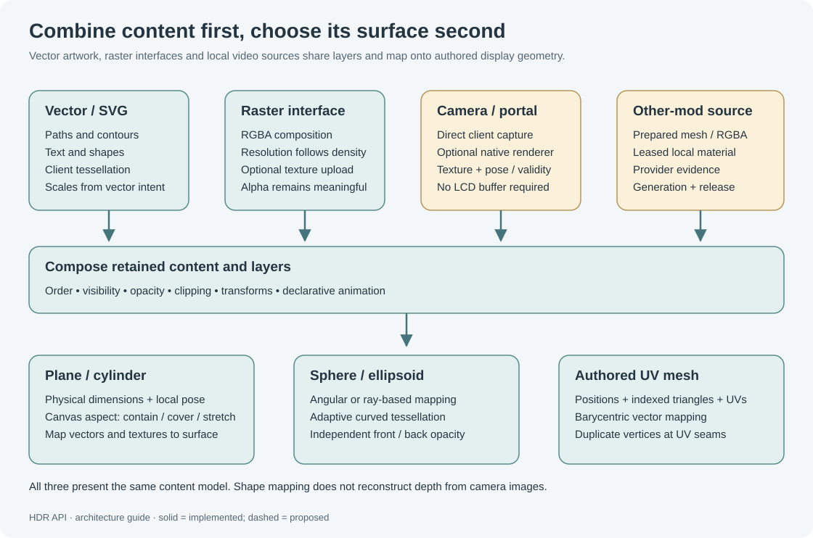

# Display surfaces

The artwork definition and the surface that presents it are separate. A line, SVG, HTML layout or provider image can share a bounded canvas while each surface maps it differently. **HDR API 0.9.11 / scene 20** adds keyed source slots and projected control routing; see [Composition](Composition.md) for a complete camera-in-HTML ellipsoid example and backend constraints.



## Physical LCDs

Select the physical panel's **Content → HDR API** mode before expecting HDR output. HDR does not take over another selected content mode.

```csharp
H("target", "HDR LCD");
H("lcd", 2, 2);                       // logical canvas width/height
H("lcd-renderer", "vector");         // native or vector
H("lcd-refresh", 30);                // requested metadata sampling
H("lcd-background", "transparent");
H("text", "title", "SYSTEMS", 0, .5, 0, .12, "cyan");
```

`lcd-settings` returns `MyTuple<string,double>` requested renderer/rate. Native is the default, with requested refresh 6 Hz; valid physical-LCD requests are 1–60 Hz. The game's native LCD texture consumption normally happens every ten simulation ticks, so requests above 6 Hz do not bypass that schedule.

The vector backend draws HDR triangles/fonts directly on an offline-calibrated panel plane each render frame. Animation/item sampling is still rate-controlled. Vanilla large/small square, wide and transparent LCD models have exact rotation/material calibration records. Unknown or modified geometry falls back to native. A vector render fault falls back per panel; a subsequent native failure disables that panel until retry. `/hdr status` reports these outcomes.

Transparent background means no forced HDR backdrop; it does not remove an opaque physical LCD's backing. Transparent panels retain their native material/reflections. Vector physical screens are front-facing only; their calibration does not establish reverse-side rendering or input.

For a wall, `H("lcdgroup", name, columns, rows, [canvasWidth=2*columns, canvasHeight=2*rows])` creates a shared tiled canvas. Use coplanar equally spaced panels with matching facing/up orientation, identical names and HDR content selected. The upper-left tile is master; panels clip to their calibrated bounds and retain physical bezels/gaps. At most eight tiles/displays fit the anchor budget. Reconstruct groups after load; a missing master leaves remaining tiles blank. `lcd-release` releases the selected group/panel.

## Projected screens

Virtual screens require a Console/Projector anchor. They need no physical LCD or cloned block.

```csharp
H("target", "HDR Display");
var caps = (VRage.MyTuple<string,string,int>)H("capabilities");
if ((caps.Item3 & 16) != 0) H("volume", false); // Console table envelope
H("range", 0);                              // retain ordinary scene safety bounds
H("screen", "main", MatrixD.CreateTranslation(0, 1.5, 0), 3.2, 1.8, 3.2, 1.8);
H("screen-background", "#12394b80");
H("text", "title", "FLIGHT", 0, .6, 0, .12, "cyan");
```

`screen(id, pose, physicalWidth, physicalHeight, [canvasWidth, canvasHeight])` creates/updates and selects. Canvas dimensions default to physical dimensions. `screen(id)` selects existing content. `screen-exists(id)` is a declaration/liveness query. `screen-target("")` returns to anchor drawing. The structural `capabilities` query in this example requires the current API build; older versions can use the known Console subtype to conditionally disable its table envelope.

| Command | Arguments | Meaning |
|---|---|---|
| `screen-pose` | Rigid `MatrixD` | Anchor-local placement |
| `screen-aspect` | `contain`, `stretch`, `cover` | Canvas fitting policy |
| `screen-background` | Paint | Transparent by default |
| `screen-opacity` | 0–1 | Whole-screen multiplier |
| `screen-visible` | Boolean | Retain declaration while hiding |
| `screen-two-sided` | `[enabled=true, frontOpacity=1, backOpacity=1]` | Reverse viewing and independent side alpha |
| `screen-side-opacity` | Front alpha, back alpha | Preserve current sidedness |
| `screen-side-settings` | None | `MyTuple<bool,float,float>` |
| `screen-refresh` | Finite Hz ≥1 | Requested ceiling; provider/local caps apply |
| `screen-settings` | None | `MyTuple<string,double,double,double>` ID, width, height, requested rate |
| `screen-remove` | None | Delete selected screen and its content |

Planes face local +Z. For curved shapes, front means the chosen inside/outside side. Reverse-side artwork is shared and text appears mirrored; this does not generate a separate reverse interface. Side multipliers affect backgrounds, source imagery and overlays, and multiply screen/layer/object alpha. Zero alpha avoids that side's source demand. Foreground offsets face the viewer on either side.

A selected screen supports geometry, SVG, images, text, layers and timelines. Select the same existing owned ID explicitly through `HDR.UI`'s `screen` command to bind ordinary controls to its canvas; selecting `HDR.Draw` alone does not scope a separate UI endpoint. Anchor-wide commands and callback curves still require anchor selection. Legacy `HDR.Api` methods address the anchor; they do not become virtual-screen methods merely because `HDR.Draw` selected a screen.

## Analytic and authored surfaces

| Command | Arguments | Notes |
|---|---|---|
| `screen-surface` | `plane/cylinder/sphere, [radius=2, horizontalRadians=2π, verticalRadians=π, side="inside"]` | Curve pose origin is centre; cylinder height uses physical screen height |
| `screen-ellipsoid` | `Vector3D radii, [horizontalRadians=2π, verticalRadians=π, side="inside"]` | Three scalar radii may replace the vector |
| `screen-mesh` | `Vector3D[] points, int[] triangleIndices, Vector2[] UV, [side="outside"]` | Flattened indexed triples; one UV per point |
| `screen-mapping` | `angular/equirectangular`, `geodesic`, `pinhole` | Analytic mapping; authored meshes use authored UVs |
| `screen-quality` | Chord error in metres, .00001–1 | Smaller values increase bounded tessellation |
| `screen-join` | Group ID, or no arguments | Join compatible external-image pinhole spherical patches |

Angular mapping maps longitude/latitude across a sphere. Pinhole maps perspective rays using `screen-camera` vertical FOV and requested image aspect; it preserves directions by intersecting sphere/ellipsoid surfaces. Geodesic is a bounded analytic patch: antipodal cases and excessive cylinder wrapping are rejected. Exact ellipsoid geodesics are not implemented.

An ellipsoid's radii are at least .05 m and its transformed extent must fit within 25 m of the anchor. Equal X/Z radii make a spheroid. Foreground layers follow its implicit normal rather than a scaled spherical radial vector.

Authored meshes admit up to 2,048 points and 4,096 triangles within shared budgets. Physical and UV triangles must be nondegenerate, positions finite and UVs in 0–1. Winding defines outside. Duplicate vertices for sharp normal seams or separate UV islands. Disconnected/overlapping UV islands intentionally repeat content. Vector content is clipped against UV triangles and mapped barycentrically; raster/source textures use the same UVs. Arbitrary meshes do not automatically preserve a camera's spherical viewing model.

```csharp
H("screen", "dome", MatrixD.CreateTranslation(0, 4, 0), 6, 3);
H("screen-ellipsoid", new Vector3D(3, 2, 3), Math.PI*2, Math.PI, "inside");
H("screen-mapping", "angular");
H("screen-two-sided", true, 1, .35);
H("screen-renderer", "raster", 1024, 512, 4);
```

Surface tessellation follows geometric chord error within bounded work. Source-UV camera density adaptation and raster-resolution LOD are separate systems; a finer density map does not automatically change `screen-quality`. Extremely fine geometry requests can fail the geometry/work limits; raster artwork can reduce geometric overlay complexity. See [GeneralSurfaceDemo.cs](../../Examples/GeneralSurfaceDemo.cs).

## Raster UI and source images

`screen-renderer("vector"|"raster", [width=256, height=144, samples=4])` chooses the ordinary artwork backend. Samples can be 1 or 4. `screen-resolution(width,height)` changes its requested image maximum. Requests allow 16–4,096 per axis with aspect at most 64:1. These settings do not promise an allocated texture of that size.

Raster UI needs the optional client renderer. It composes supported vector text/SVG/fills/strokes/layers into straight RGBA source-over output, then uploads through the local service. UI effective resolution is bounded to 2,048 per side and 1,048,576 pixels, adjusted to projected density. It retains a CPU sample-work bound and a resident upload-memory bound. An explicit raster request without the plugin stays inactive and reports `Requires plugin: HDR Client Renderer (raster UI).` It does not silently switch to vectors or throw because that optional component is absent. With a connected backend, unsupported/busy/failing composition retains its explicit logged vector fallback. `/hdr status` distinguishes requested mode from uploaded UI textures. Ordinary vector rendering remains available independently.

Packaged textured image layers and per-object emission currently require vector mode for ordinary UI composition. External camera/native image textures are a separate source layer and can coexist with either UI mode. Raster mode does not turn HDR's SVG importer into a browser engine.

`screen-source(providerId,sourceId)` binds an external client-local image/mesh source. Missing/invalid sources leave ordinary overlay/background artwork available, but do not authorize retained stale output. `screen-source-clear` detaches the source and portal declaration. Providers configure acquisition through their own boundary. See [cameras and portals](Cameras-and-Portals.md) and [mod integration](Mod-Integration.md).

## Source slots and ordered canvas

`screen-source` preserves its legacy default whole-screen source. A selected screen can additionally contain up to **16 keyed source slots**, each with its own provider/source identity, placement, clip, UV crop, order, opacity and consumer lifetime. Slots, retained artwork, labels and compatibility sprites use one ordered canvas stream. Raster artwork is split into contiguous runs where sources divide the paint order.

```csharp
H("screen", "main");
H("screen-slot", "feed", "camera-panorama", cameraId,
  new Vector4(-1.2f, -.55f, 2.4f, 1.1f),
  new Vector4(-1.2f, -.55f, 2.4f, 1.1f),
  new Vector4(0, 0, 1, 1), 10, 1.0);
var state = (VRage.MyTuple<bool,string>)H("screen-slot-status", "feed");
```

The two canvas `Vector4` values are **lower-left X/Y and positive width/height in centred canvas metres**. The provider UV is **top-left X/Y and normalized width/height**. Clip against the full placement rectangle before mapping onto the surface: partial clipping crops the image instead of stretching the visible remainder. `screen-slot-pose` applies an affine canvas transform; the selected screen's shape, aspect/view transform and surface clip then apply normally.

| Command | Arguments | Meaning |
| --- | --- | --- |
| `screen-slot` | ID, provider, source ID, `Vector4` rect, `Vector4` clip, `Vector4` UV, `[order=0, opacity=1]` | Create/replace a complete slot declaration; returns Boolean acceptance |
| `screen-slot-pose` | ID, `MatrixD` | Affine source canvas pose |
| `screen-slot-visible` | ID, Boolean | Retain/hide the slot |
| `screen-slot-opacity` | ID, 0–1 | Slot paint multiplier |
| `screen-slot-layer` | ID, local layer name or empty string | Select a local layer or clear that association |
| `screen-slot-order` | ID, integer −10000–10000 | Canvas paint order |
| `screen-slot-refresh` | ID, `[Hz=0]` | 1–120 requested ceiling; 0 inherits screen cadence |
| `screen-slot-panorama` | ID, `[FOV=105, feather=8, saturation=1.15, captureSize=1024]` | Slot-specific camera settings; same bounds as `screen-panorama` |
| `screen-slot-camera-quality` | ID, `normal`/`lite` | Slot-specific capture profile |
| `screen-slot-inherit` | ID | Restore screen camera/cadence inheritance and clear the slot's layer association |
| `screen-slot-status` | ID | `MyTuple<bool,string>` readiness and actual state/reason |
| `screen-slot-settings` | ID | `MyTuple<string,string,Vector4,Vector4,Vector4,int>` provider, source ID, rect, clip, UV and order |
| `screen-slot-remove` | ID | Remove only this slot and release its consumer |

Replacing a slot with `screen-slot` resets optional per-slot overrides; apply any desired pose/layer/camera settings again. IDs and local layer names are at most 12 characters. Canvas values must be finite and bounded to 24 m; positive rectangle dimensions are at most 12 m. At most 16 slots fit a screen, within existing shared anchor/object, provider, allocation and update budgets. Repeated source IDs do not remove those limits. Registration, pending acquisition, budget exhaustion and readiness are separate facts; preserve `RequiresPlugin:<provider>`, `Pending` or the actual provider/budget reason in diagnostics.

The [HTML frontend](HTML-Frontend.md) lowers attachments on visible explicit block IDs into the same slots. `bind-screen` retains the existing shape; `bind-sprites-screen` maps a real owned source LCD onto it. A native LCD source remains opaque RGB with real padding/update limits; it cannot supply arbitrary per-pixel alpha or embed an engine camera texture into a physical LCD. Unsupported overlap on the native backend is rejected, with no synthetic compatibility fallback.

## Controls on projected surfaces

Projected controls use the actual plane, cylinder, sphere, ellipsoid or mesh hit, then invert the declared canvas/view and artwork transform. Supported angular/pinhole/geodesic mappings share the renderer's coordinate conventions, including inward reflection and authored mesh UVs. Controls must reference current bounded planar artwork that fits the canvas; paths and rotation constraints retain their XY source-plane rules. Reverse sides use the declared visibility/opacity.

Screen pose, shape, mapping, canvas/view, clip, visibility and side changes advance the surface generation and cancel stale grants/gestures. Ordinary camera frames and source-slot changes preserve that coordinate generation. Automatic persistent mouse interaction requires the Client Renderer 0.9.13+ on the interacting viewer; the native pointer ABI is unchanged; the current 0.9.14 package adds the separate local source bridge. Existing server authorization, range, occlusion and viewer lifecycle rules remain in force. See [interactive controls](Interactive-Controls.md) and the [runnable ellipsoid demo](../../OptionalMods/HDRHtmlFrontend/Examples/HtmlCameraEllipsoidDemo.cs).

## Synthetic perspective and sprite compatibility

| Command | Arguments | Meaning |
|---|---|---|
| `screen-scene` | `Vector3D[] points, int[] triangles, Vector4[] triangleColors` | Opaque synthetic scene; one color per triangle |
| `screen-camera` | Eye, target, up, `[verticalFovRadians=π/3, near=.05, far=100]` | Synthetic/pinhole view declaration |
| `screen-raster` | `[width=64, height=36]` | Synthetic working grid, width 8–128, height 8–72 |
| `screen-orbit` | Radians/second, −2–2 | Client-side synthetic camera orbit |
| `screen-scene-clear` | None | Remove synthetic geometry |
| `sprites` | `MySprite[], [sourceWidth=512, sourceHeight=512]` | Replace bounded compatibility frame |
| `screen-sprites-clear` | None | Remove sprite frame |

Synthetic perspective resolves opaque flat triangle depth locally. It is not a captured native game view and can miss features smaller than the pixel sample grid. The sprite adapter supports selected basic shape textures, Debug vector text, alignment, rotation and nested clip rectangles. It composes at a finite compatibility raster, not a virtual native `IMyTextSurface`. Arbitrary native textures/fonts/types fail explicitly. See [ProjectedScreenDemo.cs](../../Examples/ProjectedScreenDemo.cs).

## Clipping and projection envelopes

`screen-clip(Vector4[] planes)` clips source image, background and overlays together. Up to eight anchor-space planes retain `dot(normal, point) <= W`. Call with no arguments to clear. Object `clip` instead uses `dot(normal, point)+W >=0` in object space.

Projector `range(radius)` adds an inscribed 20-face range envelope; zero disables it. Console `volume(enabled, [height=2, lowerX=1, lowerZ=.75, upperX=1.8, upperZ=1.35, bottom=.1])` configures a truncated pyramid. This command requires the Console/Holo Table family. Disable Console volume before deliberately placing a large sphere outside the table envelope; ordinary projector anchors do not need the table command.

Geometry is clipped on the client. Native miniature block/grid previews are conservatively hidden when their whole bounds do not fit, because their supported rendering path cannot slice model shaders at the envelope. Clipping does not disable authorization, draw-distance bounds or the 25 m maximum scene radius.
