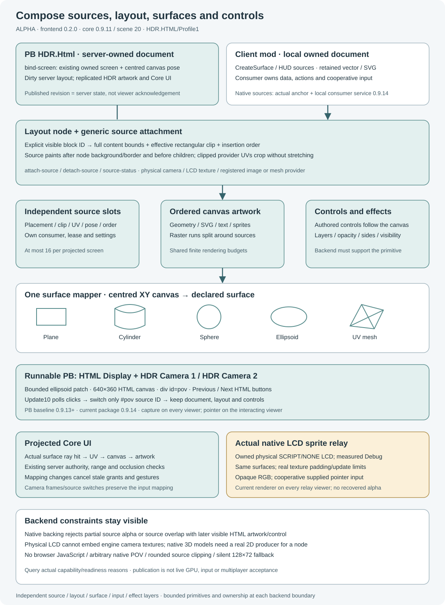

# Optional HTML/CSS frontend

**ALPHA.** [`HDRHtmlFrontend` 0.2.2](../../OptionalMods/HDRHtmlFrontend/README.md), with **core 0.9.11 / scene 20**, is an optional mod-native frontend for **`HDR.HTML/Profile1`**. It translates a strict HTML/CSS UI subset into HDR's existing retained drawing paths. Client mods own local documents; the `HDR.Html` PB property owns authenticated server documents on shared block displays. Projected documents combine layout nodes, provider sources, all five surface kinds and the input/effects supported by the selected backend. Neither route implements a complete HTML5 browser.

## Setup and first output

Manually install and explicitly add both the core **HDR API 0.9.11+** world mod and the **HDR HTML frontend 0.2.2** world mod. Nothing is auto-installed or enabled. On startup the frontend registers its services and draws no demo.

Enter `/hdrhtml hud vector` or `/hdrhtml world svg`. Either location accepts `vector` or `svg`; the world demo stays at the flat plane placed three metres in front of the camera. `/hdrhtml status` reports backend, desired/visible revision, layout builds and errors. `/hdrhtml clear` releases only the demo owner. These commands do not capture game input, modify PBs/blocks, change preferences or load network resources.

For a PB display, put [`PlainHtmlPbDemo.html`](../../OptionalMods/HDRHtmlFrontend/Examples/PlainHtmlPbDemo.html) in the **PB's Custom Data** and paste the small [`HtmlPbDemo.cs`](../../OptionalMods/HDRHtmlFrontend/Examples/HtmlPbDemo.cs) in its code editor. Name an authorized LCD/Console/Projector **`HTML Display`**, then run with an empty argument or `demo`. A physical LCD needs its **HDR API** text-surface script selected manually first. The mod owns document mounting, target lookup, layout, source watching, range binding and retirement. Your UI stays plain HTML/CSS; the PB only invokes `run` and prints status. See the [plain HTML tutorial](../../OptionalMods/HDRHtmlFrontend/Docs/PB-Tutorial.md).

Full `html`/`head`/`body` documents with embedded `<style>` already belong to the accepted profile; this adapter adds no browser parser. Edited Custom Data is checked every 30 simulation ticks, and invalid replacement HTML preserves the last published frame with a persistent diagnostic. `reload` retries, `status` inspects, and `clear` removes only this automatic mount. No PB update loop or appended drawing helper is needed. Run deliberately again after PB program/power or target retirement.

The separate advanced [`HtmlPbBindingsDemo.cs`](../../OptionalMods/HDRHtmlFrontend/Examples/HtmlPbBindingsDemo.cs) shows polled events linked to a script's own variable. It is for controller/gameplay integration; ordinary authoring does not need that C# layer. `data-action` remains descriptive data and never automatically runs gameplay actions.

For the camera-in-HTML ellipsoid, paste [`HtmlCameraEllipsoidDemo.cs`](../../OptionalMods/HDRHtmlFrontend/Examples/HtmlCameraEllipsoidDemo.cs). Name a dedicated Console/Projector **`HTML Display`**, plus working physical cameras **`HDR Camera 1`** and **`HDR Camera 2`** on the PB's construct. `demo` creates a bounded ellipsoid patch and a centred 640×360 HTML document; a `camera-panorama` attachment fills `#pov`. Its HTML **Previous** / **Next** buttons are polled in `Update10` and switch only the selected camera ID, keeping the document and controls. Every camera viewer needs the Client Renderer **0.9.13+**; automatic persistent mouse controls need it on the interacting viewer. See [Composition](Composition.md) for setup, exact API snippets and representation limits. `previous`, `next`, `status` and `clear` are explicit terminal commands.

For actual native sprites, use the separate [`HtmlPbSpritesDemo.cs`](../../OptionalMods/HDRHtmlFrontend/Examples/HtmlPbSpritesDemo.cs). Manually configure **`HTML Sprite Source`** as **SCRIPT with no selected script (NONE)** and reserve it exclusively. `lcd`/`demo` draws directly, plugin-free; `world` relays that real LCD texture to Console/Projector **`HTML Display`**, requiring existing Client Renderer 0.9.13+ on **every viewer**. It uses actual source size/Debug text, never creates a virtual LCD and makes no automatic mode/background writes.

## Supported authoring boundary

Profile1 accepts block containers, paragraphs/headings, inline spans, line breaks, buttons and range controls; styling covers solid boxes, content dimensions, margins/padding, single-row/column flex growth, measured text and rectangular clipping. It accepts embedded/inline CSS and compound element/class/ID selectors. See the [complete accepted/rejected profile](../../OptionalMods/HDRHtmlFrontend/Docs/Profile.md) before adapting browser markup.

The frontend embeds no JavaScript engine, browser DOM, Canvas, WebGL, network loading, iframe, URL asset loading or HTML event-handler execution. The separate [JavaScript Runtime prototype](JavaScript-Prototype.md) can explicitly bind client-local documents for scoped ES5.1 events, timers and atomic text/data/source updates. PB JavaScript execution is not implemented. The parser still rejects `<script>`, inline handlers and unsupported tags/styles, including ``, `<svg>`, `strong`, `em`, form/text-input controls, grid, positioning and wrapping flex. The `svg` backend groups generated paint; it does not accept arbitrary SVG markup through HTML.

Vector/SVG uses the same packaged Inter outlines as core HDR text and the exact **`HDR.TextMetrics/1:Inter:cap-height`** metric schema. A 16px font means 16 logical pixels of capital height, not a browser em box. Unsupported Unicode scalars render as `?`; shaping, kerning, ligatures, bidi and system-font fallback are absent. Native LCD instead measures the actual target's Debug font and uses a line-height proxy. Fonts and layout cannot be assumed interchangeable between these backends.

## Choose a renderer

| Path | Implemented behavior |
| --- | --- |
| Retained vector | Plugin-free local HUD/world plane; separate owned mesh/text/SVG items favor small dirty changes |
| Grouped SVG | Plugin-free local HUD/world plane; contiguous chunks lower item/call count, but a dirty chunk recompiles all members |
| Native LCD | Explicitly owned vanilla surface in `ContentType.SCRIPT` with no selected text-surface script; solid rectangle/Debug text/scissor subset |
| PB core SVG | Server parses/layouts dirty documents and publishes bounded core SVG/UI declarations; display plugin-free, buttons/ranges need existing Client Renderer 0.9.13+ |
| PB mapped SVG | `bind-screen` keeps an existing owned plane/cylinder/sphere/ellipsoid/mesh; `attach-source` places a generic provider into an explicit node with ordered paint and rectangular clipping |
| PB direct sprites | Actual native frames on an owned physical SCRIPT/NONE LCD, Debug metrics, plugin-free; supplied cooperative pointer input |
| PB native world relay | Actual owned source LCD texture through existing `lcd-texture` projected screen; existing Client Renderer 0.9.13+ on every viewer; supplied cooperative pointer input |
| PB mapped native sprites | `bind-sprites-screen` maps the real source into an existing owned screen of any of the five shapes; actual native padding/UV, opaque RGB and cooperative input remain |
| Off-screen HTML/browser rasterizer | Future alternative only; not implemented |

The native one-document-per-surface guard protects frontend owners from each other; the consumer still excludes arbitrary outside sprite writers. Native LCD retains vanilla texture/update limits. Projected HTML uses the core surface mapper and ordered canvas; sources insert after a node's background/border and before its children. Full node content bounds and effective ancestor/own rectangular clip keep provider UVs stable when clipped. The PB route retains existing [display-surface](Display-Surfaces.md) and [PB](Programmable-Blocks.md) renderer contracts, including physical LCD cadence/model restrictions and Console/Projector world envelopes. Ordered canvas paint does not add CSS group compositing or rounded clip masks.

Unchanged documents reuse layout/paint; updates coalesce. Geometry admission counts the actual packaged text/SVG output and rejects exceeded grants instead of reducing detail. The [rendering comparison](../../OptionalMods/HDRHtmlFrontend/Docs/Rendering.md) includes actual fixture geometry and one offline CPU run: grouping reduced retained calls while preserving triangle count, and initial preparation was slower in that run. This evidence makes no live GPU, FPS, input or multiplayer promise.

Aggregate geometry is **unlimited by default**: point and primitive settings each use `0`, including the HTML painter's `MaxPoints` / `MaxPrimitives`. The painter queries actual owner geometry settings and adds no fixed 8,192 aggregate ceiling. Explicit finite configurations still validate content and source caches; structural limits and separate per-frame drawing work remain. See [scene budgets](Performance-and-Troubleshooting.md#scene-budgets).

## Integrate a programmable block

Use the tiny bootstrap and plain HTML tutorial for ordinary authoring. The [advanced PB API reference](../../OptionalMods/HDRHtmlFrontend/Docs/PB-API.md) keeps the raw `HDR.Html` delegate, version **`HDR.HtmlPB/0.1`**, for composed screens/provider attachments and explicit controller logic. `run(targetName, command)` returns printable mount status; its revision is **server publication**, not the client-local API's visible revision. Existing scene replication carries bounded geometry and controls to viewers; clients do not receive executable HTML/JavaScript. A published document can still be culled, occluded or disabled on a viewer.

Core SVG display is plugin-free. **Both core SVG button and range events require HDR Client Renderer 0.9.13+ on the interacting viewer**, using the existing [persistent control viewer](Interactive-Controls.md); no additional plugin update is required. The sprite backend instead accepts `pointer`/`pointer-cancel` from an already owned GUI/touch/eye provider, or explicit synthetic terminal tests. It does not automatically attach core mouse input or read global mouse state. Native events use published document revisions and player ID zero; core SVG uses core value revisions and player IDs.

Native physical output needs no plugin, but the world sprite relay requires existing Client Renderer 0.9.13+ on every viewer. Its source is opaque RGB with native resolution/update/padding and background behavior; transparent canvas pixels cannot be recovered. Existing whole-projection opacity remains a full-plane effect. Source/generation or target/source retirement invalidates documents before automatic redraw. Rebind deliberately after correcting the cause. Shared same-process native claims prevent competing frontend documents, while external writer ownership remains the caller's responsibility. Owned cleanup and filtered polling preserve unrelated core declarations/events. `data-action` is descriptive data, never a `TryRun` instruction.

`bind-screen` and `bind-sprites-screen` locate the document centre in canvas metres (+X right, −Y down); ordinary `bind`/`bind-sprites` retain top-left poses. `attach-source`, `detach-source`, `source-capabilities` and `source-status` separate declaration support from acquisition readiness. A physical LCD cannot embed external engine camera textures. A mapped native LCD rejects source overlap with later visible HTML artwork/control and partial source alpha because its backing is opaque; it supplies no silent 128×72 fallback. The current backend/provider reason is part of the diagnostic contract.

Projected Core UI ray-tests the actual surface and inverts the current canvas/artwork mapping. Pose, shape, mapping, clip, visibility or side changes cancel stale input contexts; ordinary video frames and camera switches preserve controls. Physical camera IDs select actual capture viewpoints. `screen-camera` configures synthetic/pinhole rendering, not an arbitrary virtual native POV. Server publication and offline compilation still do not establish live GPU, input or multiplayer acceptance.

## Integrate a consumer mod

Copy [`HdrHtmlApi.cs`](../../Api/Mods/HdrHtmlApi.cs) into the consumer mod and adapt the [cooperative input example](../../OptionalMods/HDRHtmlFrontend/Examples/HtmlConsumerExample.cs). Use the [local API reference](../../OptionalMods/HDRHtmlFrontend/Docs/Local-API.md) for discovery, owner IDs, document methods, generation changes, events and cleanup. Native frontend classes do not cross the local delegate boundary.

`CreateSurface` creates a centred local HTML canvas on plane/cylinder/sphere/ellipsoid/mesh with `vector` or `svg`. `AttachSource` binds a provider to an explicit node; an actual block anchor and explicit local-consumer provider negotiation preserve source authority. Native camera/LCD/portal attachment needs **Client Renderer 0.9.14**, while the PB camera/persistent pointer route above remains compatible with **0.9.13+**. Missing/unsupported local capability rejects changes with the actual reason. `PointerRay` uses the consumer's owned world ray and committed frame; local event revisions remain document revisions. The [composition guide](Composition.md#compose-in-a-client-local-mod-context) shows exact helper calls and the underlying generic `HdrModApi` surface/slot route.

HUD documents keep `CreateHud`, then use `SetSourceAnchor(document, actualBlock)` and `AttachSource`; source regions and cooperative `Pointer` remain top-left Y-down pixels. HUD curvature is unsupported. Existing `CreateWorld` supports the same anchored source route through the shared plane mapper, keeping its top-left pose across resize and existing pixel input; `PointerRay` works there too. Genuine physical `CreateNativeLcd` rejects external engine texture attachment explicitly.

The consumer supplies authored logical pointer coordinates from a GUI/input session it already owns and blocks; the frontend reads no global mouse buttons. Poll button/range events, interpret `data-action` as data and feed accepted values back with `SetData`. Cancel on focus loss. Input follows the last committed visible revision, so inspect status when a replacement is pending or fails. Release/dispose affects only that owner's documents.

Continue with [mod integration](Mod-Integration.md), [API boundaries](API-Boundaries.md) and [performance/troubleshooting](Performance-and-Troubleshooting.md) for core HDR behavior.
