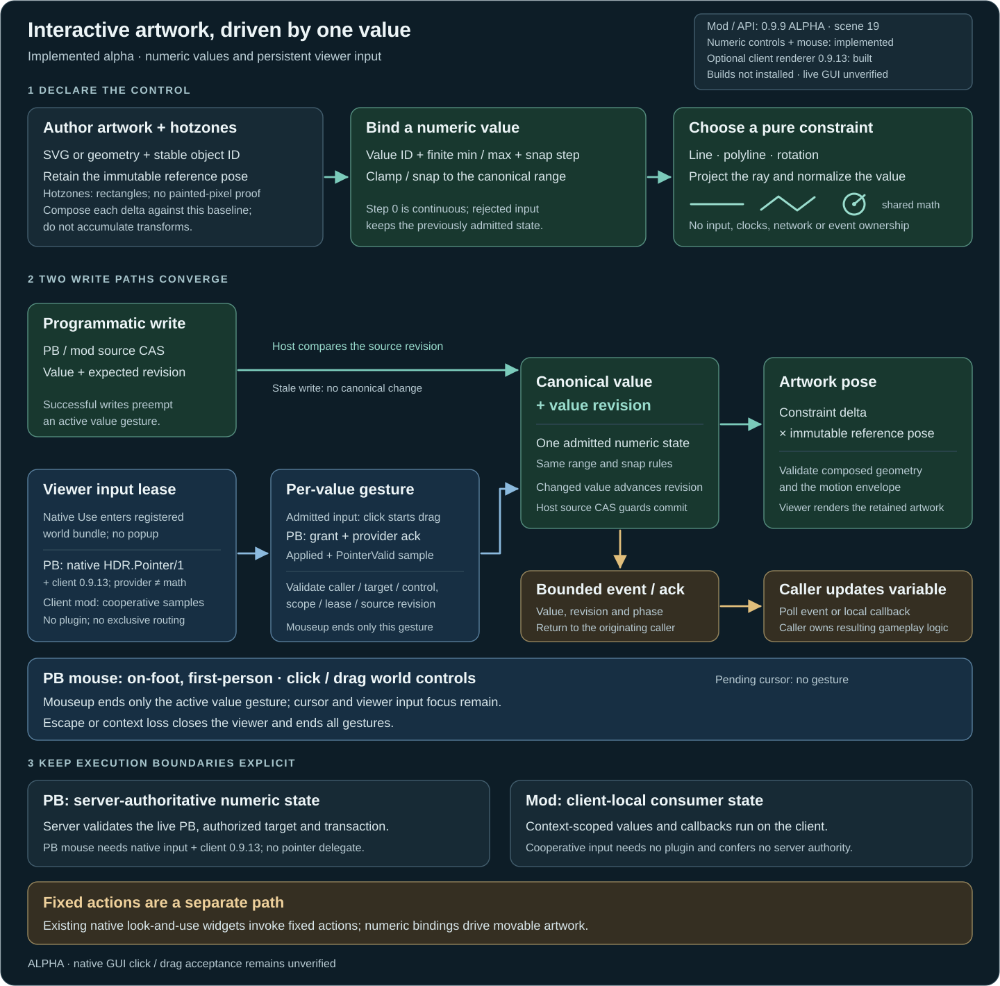

# Interactive artwork controls

HDR API **0.9.9**, scene protocol **19**, optional Client Renderer **0.9.13**.

> **ALPHA:** Numeric bindings, constrained controls and the native bundle viewer are implemented and checked offline. Install the optional client renderer for native mouse focus. Live GUI/input, GPU and multiplayer acceptance remain unverified.

Attach a control to one authored drawing item, bind it to a numeric value, and constrain its motion to a line, polyline or rotation. Range and step belong to the value. Script writes and accepted player edits pass through the same clamp/snap rule and update the same retained artwork pose. Each control can enable dragging independently.

The value is an HDR numeric record. HDR does not find a PB field or mod variable by name. A PB explicitly assigns its variables from queries/events and explicitly writes source changes back. A mod can register local getter/setter delegates and call the SDK's reconciliation method outside `Draw`.



## Supported controls and input

| Capability | Scope and requirement |
|---|---|
| Finite numeric ranges, snapping, line/polyline/rotation math | Pure kernel; independent of the game input route and client plugin |
| PB numeric declarations, compare-and-set writes, retained artwork binding, bounded value events | Server-owned caller/target state through `HDR.UI/1`; no client plugin for numeric declarations/source writes |
| Client-mod controls and local variable callbacks | Owner-scoped `HDR.ModClient/1` context; cooperative pointer supplied by the consumer; no client plugin |
| Exclusive game mouse routing and persistent bundle viewer | Optional `HDR.Pointer/1` provider in HDR Client Renderer 0.9.13; on-foot first-person scope; live routing unverified |
| Existing fixed buttons/actions | Continue using the block UI/action API; numeric value changes do not execute arbitrary commands |
| Hologram effects on a moving item | Existing 0.9.8 effect capability, subject to its target/effect restrictions |

The native pointer provider supplies input samples and finite leases. It does not pick artwork, validate multiplayer identities or expose a PB hardware-input callback. A registered provider and an advertised capability are insufficient to enable a gesture: the consumer needs an **Applied + PointerValid** sample and its semantic interaction grant. Without that provider, native dragging stays inactive and reports a bounded `Requires plugin: HDR Client Renderer` explanation. Source writes and ordinary fixed look-and-use actions remain available.

Use a dedicated **Console or Projector** for the PB example. Physical LCD picking supports the planar subset: XY paths, local-Z rotation and admitted artwork poses that remain planar. Live LCD acceptance remains unverified. Curved/mesh display-surface picking and arbitrary triangle/fill-hole hit testing remain outside the contract. A curved *polyline constraint* moves a handle along authored points; it does not imply that a curved display surface can be picked.

## Try the PB demonstration

Use [InteractiveControlsDemo.cs](../../Examples/InteractiveControlsDemo.cs), generated as `artifacts/InteractiveControlsDemo.pb.cs` by the example build. Name a Console/Projector **HDR Controls** on the PB's construct and run `demo`. Use a separate anchor: the demo sets its drawing view, range, envelope and shared rendering budget.

The retained display has three independent controls:

| Artwork | Bound script variable | Range and constraint |
|---|---|---|
| Throttle handle | `_throttle` | 0–100, step 5; straight line |
| Trim handle | `_curve` | 0–1, step `.05`; curved polyline with arc-length mapping |
| Rotor arrow | `_angle` | −π/2…π/2 radians, step π/12; rotation about local Z |

`throttle:65`, `trim:75` and `angle:45` demonstrate source writes moving the controls back. The command arguments for trim and angle use percentages/degrees; the stored variables use 0–1 and radians. `reset` returns all values to zero. `clear` removes the caller's controls and artwork. Run `demo` after script replacement or world-load retirement.

The PB constructor sets `UpdateFrequency.None`. Setup declares artwork, values, bindings and constraints once. A fixed `controls:values` wake argument drains coalesced value events and assigns the real variables; it also queries the canonical values to recover from bounded event delivery. HDR animates retained effects and retains control poses without a PB frame-writing loop. Source commands work through the numeric core; native mouse operation requires the optional input provider.

On foot in first-person view, aim at an authored control and press **Use** to enter its bundle viewer. The artwork stays on the world display; no camera-facing popup opens. Click and drag any eligible control in that bundle. Mouse-up commits the current value gesture and releases its numeric lock while the cursor and viewer remain open for the next control. **Escape** or context loss closes the viewer and cancels remaining gestures. Live game routing remains unverified.

## PB declaration order and exact commands

`U` below forwards to the PB's `HDR.UI` property; `H` forwards to `HDR.Draw`. Both use `Func<string,object[],object>`. Select the same authorized target on each endpoint before declaring data.

```csharp
H("target", target);
U("target", target);
H("svg", "knob", authoredSvg, MatrixD.CreateTranslation(-.6,.3,0), 8);
U("bundle", "main", true);
U("value", "throttle", 0d, 0d, 100d, 5d);
U("control", "slider", "main", "knob", 0d, 0d, .18, .18);
U("bind-value", "slider", "throttle");
U("constraint", "slider", "line", Vector3D.Zero, new Vector3D(1.2,0,0));
U("draggable", "slider", true);
U("value-notify", "controls:values");
```

Artwork must already exist and belong to this caller. One numeric control owns an artwork item's pose. A PB control's rectangle is **centre X, centre Y, width, height** in the item's untransformed local XY plane. Its pose carries the rectangle with the item. This is an explicit author hotzone and can include padding or transparent artwork holes; it is not a pixel/triangle coverage test. Bundle visibility, item visibility, target access and caller lifetime remain part of interaction admission.

| `HDR.UI/1` operation | Arguments after operation | Result/purpose |
|---|---|---|
| `value` | `id, initial, min, max[, step]` | Declare a finite numeric record; omitted step is 0 |
| `control` | `controlId, bundleId, artworkId, centreX, centreY, width, height` | Associate a hit rectangle with owner artwork |
| `bind-value` | `controlId, valueId` | Explicit numeric binding |
| `draggable` | `controlId, bool` | Enable/disable drag participation |
| `constraint` | `controlId, "line", Vector3D from, Vector3D to` | Straight local motion |
| `constraint` | `controlId, "path", Vector3D[] points` | Piecewise-linear local motion |
| `constraint` | `controlId, "rotation", Vector3D pivot, Vector3D axis, angleMin, angleMax` | Numeric range maps to angular endpoints in radians |
| `get-value` | `valueId` | `MyTuple<double,long>`: canonical value, value revision |
| `set-value` | `valueId, requested[, expectedRevision]` | `MyTuple<bool,double,long>`: accepted, canonical/current value, current revision |
| `poll-value-events` | none | Detached event array; drains this owner/target's pending value events |
| `value-notify` | fixed PB argument | Register a bounded deferred PB wake; the argument carries no value payload |
| `clear` | none | Retire this caller/target's UI values, controls and interaction lifetime |

`U("version")` remains `HDR.UI/1`; the numeric/viewer API is additive. Its static `capabilities` report includes `values=1`, `constraints=line,path,rotation`, `mouse=client-provider`, `viewer=persistent-bundle` and `pointer=HDR.Pointer/1`. Those tokens describe support and requirements, not the current viewer's acknowledged input route.

Query the short Draw endpoint for local registration and a printable reason:

```csharp
var status = (VRage.MyTuple<bool,bool,string>)H("plugin-status", "interactive-pointer");
// known feature, registered locally, explanation
if (!status.Item2) Echo(status.Item3);
```

`interactive-pointer` requires HDR Client Renderer **0.9.13+**. Registration does not prove that a lease has received exclusive native input. A dedicated server reports the known feature with local registration false and a viewer-dependent explanation; keep shared declarations available for viewers that have the provider. The existing `bind`/`action` aliases and button grammar remain separate: a fixed action binding is not a getter/setter binding, and a numeric record is not an arbitrary PB command channel.

## Range, snapping and motion

Requests, range endpoints and steps must be finite. Numeric magnitudes and range span are bounded to `1e12`; `min < max`. Step 0 is continuous. A positive step cannot exceed the span, create more than `1e9` intervals, or be too small to advance representably at the endpoints. Invalid declarations/writes reject atomically and retain the previous admitted value and pose.

Clamp a bounded request to the range, then choose the nearest value on the grid anchored at `min`. Exact ties choose the larger value. `max` is always an admissible endpoint, including when it is off-grid. For range 2…9 and step 3, the admissible values are **2, 5, 8, 9**. The returned value is the canonical result; assign it back to the caller variable instead of keeping the unsnapped request.

Line/polyline values map the bound numeric range linearly to **arc length**. A path needs 2–256 finite vertices, with every adjacent segment nondegenerate and every cumulative length representable. The kernel defensively copies points. A curved authoring tool should sample its curve to a bounded polyline; the control does not interpret SVG curve commands as its constraint automatically.

Rotation uses an item-local pivot and normalized axis. The angular endpoints are radians and map linearly from the bound numeric range. For a value range 0…100 with angle endpoints −π/2…π/2, value 50 means angle zero. If the value itself is radians, use matching numeric and angular ranges as the demo does. The kernel bounds rotation angles to absolute `1e6` radians and the angular span to `64π`.

Bindings latch an immutable reference pose and the numeric value at admission. The initial bind preserves the artwork's authored pose. Every later pose derives from that reference; it does not accumulate successive transform deltas. VRage uses row vectors:

```text
path pose     = Translation(point(newValue) - point(referenceValue)) * referencePose
rotation pose = Translation(-pivot) * Rotation(axis, angleDelta)
                * Translation(pivot) * referencePose
```

The constraint lives in the artwork's local coordinates before its authored scale/rotation/translation. Put a minimum-value handle at the visible track's starting point for an intuitive baseline, as the examples do. An explicit authored `transform` is a source change: it rebases the reference pose at the current value and preempts the old gesture. Stop all retained Draw tracks/playback on the item before binding a numeric constraint, including opacity tracks; unbind before starting them again. Retained cosmetic effects use their separate effect evaluator and can accompany controls. Numeric and placement admission still enforce the display/context's geometry limits; a valid kernel descriptor does not bypass the rendering envelope.

Path dragging preserves the initial grab offset. Dragging past either outer endpoint follows its tangent before range clamping, so an off-centre grab can still reach the limit. Internal junctions remain bounded to their adjacent segments. At self-crossings it retains branch identity and walks adjacent segments through reached junctions. Rapid movement across a folded corner can need a sample near that junction. Near-parallel ray/segment configurations reject that sample recoverably. Rotation intersects the forward viewing ray with the pivot plane; parallel, behind-origin and near-pivot samples reject. Angular movement between accepted samples must be less than π to infer direction unambiguously. Author usable tracks and generous hit rectangles with these viewing limits in mind.

## Two-way PB values and revisions

Events have this exact standard/game tuple shape:

```csharp
VRage.MyTuple<string, string, string, VRage.MyTuple<double, long, long>>[]
// kind, controlId, valueId, (canonicalValue, valueRevision, playerId)
```

PB event kinds are `begin`, `change`, `commit`, `cancel` and `click` for a non-draggable numeric control. `change` represents the latest accepted edit, `commit` finishes an edit, and `cancel` ends a revoked gesture. Programmatic changes use an empty control ID and player ID zero. Updates may coalesce; consume the returned canonical number and revision rather than reconstructing deltas. The fixed wake only tells the PB to poll. Mutation queues the wake; it does not call the PB inline or invoke user code from a rendering pass. The fixed argument is bounded to 128 characters; wakes allow at most four owners per frame and a six-tick interval per owner.

```csharp
foreach (var e in events)
    if (e.Item3 == "throttle") _throttle = e.Item4.Item1;

var old = (VRage.MyTuple<double,long>)U("get-value", "throttle");
var written = (VRage.MyTuple<bool,double,long>)U("set-value", "throttle", requested, old.Item2);
_throttle = written.Item2; // Also returns current state if the CAS lost.
```

The value revision changes when the canonical number changes. Definition revision protects changed controls/bindings; source identity protects replaced artwork or a rebased pose; publication/data revision carries authoritative updates. These serve different purposes. Moving a value does not redefine the entire UI. A same-canonical source write can succeed without increasing the numeric revision, but still cancels an active pointer gesture: the source explicitly took authority.

Compare-and-set protects source writes from overwriting a concurrent accepted edit. On a stale expected revision, `set-value` returns `false` and the current canonical value/revision, without mutating it. Choose a deliberate policy before retrying; the demo keeps the newer state. Unconditional writes omit the expected revision and intentionally preempt active input.

## Client-mod bindings and cooperative input

Use the joined [HdrModApi.cs](../../Api/Mods/HdrModApi.cs) with [InteractiveControlsModExample.cs](../../Examples/Mods/InteractiveControlsModExample.cs). Its HUD demonstrates a line slider, curved polyline handle and local-Z rotor, with readouts and a small planar flicker effect. The source file supplies explicit methods for your own UI input route; it does not obtain global mouse capture.

All mod commands have their **context handle first**. Unlike the PB centre-based rectangle, `HdrModApi.Control` takes a `Vector4` containing **local left/top X/Y, width, height**. HUD coordinates are pixels with positive Y down. Positive local-Z rotation therefore appears clockwise in the HUD. World-context coordinates remain model units, and `PointerRay` accepts a world-space origin/direction for context picking.

```csharp
hdr.Value(context, "throttle", 0, 0, 100, 5);
hdr.Control(context, "slider", "knob", new Vector4(-16,-20,32,40));
hdr.BindControlValue(context, "slider", "throttle");
hdr.ConstraintLine(context, "slider", Vector3D.Zero, new Vector3D(420,0,0));
hdr.Draggable(context, "slider", true);
hdr.BindValue(context, "throttle", () => _throttle, v => _throttle = v);

// Run on the client simulation thread, outside Draw:
hdr.Pointer(context, ownedPixelX, ownedPixelY, leftButtonHeld);
hdr.UpdateBindings();
```

The SDK also exposes `ConstraintPath`, `ConstraintRotation`, `GetValue`, `SetValue`, `PollValueEvents`, `CancelPointer` and `PointerRay`. The local adapter's `BindValue(context,id,Func<double>,Action<double>)` returns an `IDisposable`; `UnbindValue` removes one binding. Registration itself runs no callbacks. The first explicit `UpdateBindings` treats the getter as source authority and reconciles through a fresh-revision CAS. Later source changes write back; unchanged source plus a changed HDR revision invokes the setter. A clamped/snapped source request is delivered back through the setter. Callback failures detach the affected binding and set `LastBindingError`.

Do not call reconciliation from `Draw`, recursively mutate the same binding in its callbacks, or repeatedly redeclare controls every frame. The example's setters assign variables and mark readouts dirty; `UpdateAfterSimulation` applies the readout writes. Mod `Value` rejects an existing numeric ID: use `SetValue` for source changes. Re-declare a mod control before changing its bound value when a constraint has already been admitted. Replacing a mod item's geometry retires its controls; an explicit transform rebases them at the current value. Independent legacy hit bounds remain independent.

Context clear/destroy, endpoint replacement, reconnect, unbind, raw `remove-value` and disposal retire adapter registrations. Rebuild declarations and explicitly register callbacks for the new connection generation; stale bindings do not replay into a replacement owner. Mutating another artwork coupled to the same numeric value also preempts that value's active gesture. After pointer cancellation or programmatic preemption, the mod input path requires button release before admitting another held-button drag.

For cooperative input, the consumer owns its screen/UI route and supplies a fresh sample each update. Convert to HDR viewport pixels before `Pointer`, or use world-space `PointerRay` for a world context. Cancel immediately on lost focus, screen closure, owner loss or missing input. Reading `MyAPIGateway.Input` reports mouse state but does **not** prove that gameplay or another GUI has suppressed that click. Input suppression belongs to the consumer or the proven native provider. The complete mod example exposes `BeginCooperativeInput`, `SubmitOwnedPointer` and `EndCooperativeInput` for that explicit handoff.

Mod contexts and their values are **client local**. Their tuple shape matches the numeric event envelope above, but local event kinds are `begin`, `change`, `end`, `cancel` and programmatic `set`; PB completion uses `commit`. Value-event player ID is zero for this local path. HDR does not replicate your mod variables or authorize gameplay changes. A mod that needs shared state owns its network protocol, server validation and authoritative data, then writes the accepted state back to its local control.

## Input leases, multiplayer and retirement

PB declarations and values are server authoritative. An interaction transaction is scoped to the authenticated sender, caller, target, character, control, value and definition/source revisions. Access, visibility and context remain valid throughout the gesture. One active lease owns a numeric value; another player cannot take it over by sending an update. Requests are finite, bounded, sequenced and rate limited; queued moves coalesce while terminal release/cancel retains its own path.

The default send/apply cadence is **10 Hz**, configurable to **1–30 Hz**. Up to 32 viewer grants and 32 value leases are admitted, with one value lease per peer. Value idle/hard limits are 180/1,800 simulation ticks; viewer idle/hard limits are 1,800/36,000 ticks, with validated heartbeats refreshing only its idle limit. Viewer focus freezes the bundle's control membership and source epochs, including hidden siblings. Hidden siblings remain unpickable, and changed membership/epochs require fresh focus.

Source writes, changed definitions/bindings, artwork replacement/transform, hidden or removed content, lost target access, disabled/retired caller, script replacement, context loss and expiry revoke retained gestures. Clear followed by reusing the same ID receives a fresh value lifetime: an old revision/lease cannot edit the newly declared value. A missed release does not reserve the value forever. This is server admission behavior, not permission to mutate other PBs or targets.

The persistent viewer grant, per-value gesture lease and local provider input lease are separate lifetimes. Native **Use** on a registered hotzone requests viewer focus and acquires the provider in that actual input frame while the live local character is on foot in first-person view, gameplay is focused and mouse/tool controls are neutral. Viewer admission locks no numeric value. Only an actual mouse-down on a same-bundle control begins its value lease; mouse-up releases that value while preserving the viewer and native cursor. Escape/context loss closes the viewer, cancels its value gestures and releases provider input. The default is persistent bundle focus.

`Pending` may retain its own visible cursor, but never authorizes a gesture. Only the provider's own exclusively routed native input callback can acknowledge `Applied`; the viewer/value grants and **Applied + PointerValid** with a fresh routed frame are required before delivery. An applied mouse-down during ACK latency can latch its original grab offset without prediction. It activates only after the grant with the button still held; releasing before the Begin ACK cancels the request, including a delayed grant.

The world pointer ray uses the actual inverse view/projection matrices and camera origin. Off-axis projection/zoom and same-aspect dynamic resolution are covered offline; unproven nonzero viewport offsets or aspect mappings fail closed. The transport does not infer the ray from a field-of-view shortcut. LCD mapping recovers a physical panel point and an orthographic source ray; projected-degenerate constraints reject.

Escape, menus/tool controls, OS focus loss, death, controlled-entity change, shared-input routing, screen loss, timeout and provider withdrawal cancel gesture samples immediately. A release guardian drains held mouse/tool controls before removing its own input screen. The provider does not call `EndShoot`, move a player, pause the world, change the camera or overwrite global input flags. Its compile/fake-engine checks do not establish that the live engine routes every case as intended.

## Authoring and hologram effects

Start with a bounded SVG or vector drawing item. Its ID identifies artwork; a separate control ID identifies interaction; a value ID identifies data. Export SVG without scripts, event handlers or external assets, then declare the artwork before its control. Sample a curve separately into local `Vector3D[]` points, provide a local hit rectangle and choose a finite range/step. HDR does not derive a draggable constraint from an SVG path's name or reflect a variable named in the SVG.

Attach [hologram effects](Special-Effects.md) to the moving item by artwork ID. The PB example adds shallow depth copies to the line handle/rotor and gentle flicker to the path handle. Effects are cosmetic and use existing budgets; they do not enlarge the admitted range, create physical collisions or grant input capture. HUD effects must remain planar. Keep interactive hit targets visible and readouts legible, especially when flicker or dissolve makes the artwork faint.

## Validation limits

The independent math probe passes **68 cases / 1,517 assertions** after the endpoint/grab-offset repair. Pointer validation passes **741 pure-policy and 418 actual-adapter fake-engine assertions**, and its native game/Pulsar build has zero warnings/errors. Transport checks cover persistent multi-control gestures, mouse-up input retention, Escape/Blur, pending ownership, ACK latency, reconnect and retired-click isolation. The combined runtime compiles as C# 6. These are offline checks, not live input acceptance.

Both examples compile as C# 6 against installed game assemblies: the PB also passes the game type-safety rewrite compile, and the mod example compiles with the actual integrated SDK. The accessible SVG renders and passes visual inspection. The [build guide](../Contributing.md) describes repository checks.

Live click/drag, Alt-Tab, held-button exit, menus, death/world leave, concurrent players, latency/rejoin, actual pick-target geometry and coexistence with other input plugins still need game acceptance before the optional input capability can be described as production ready. Build success does not prove those outcomes.
