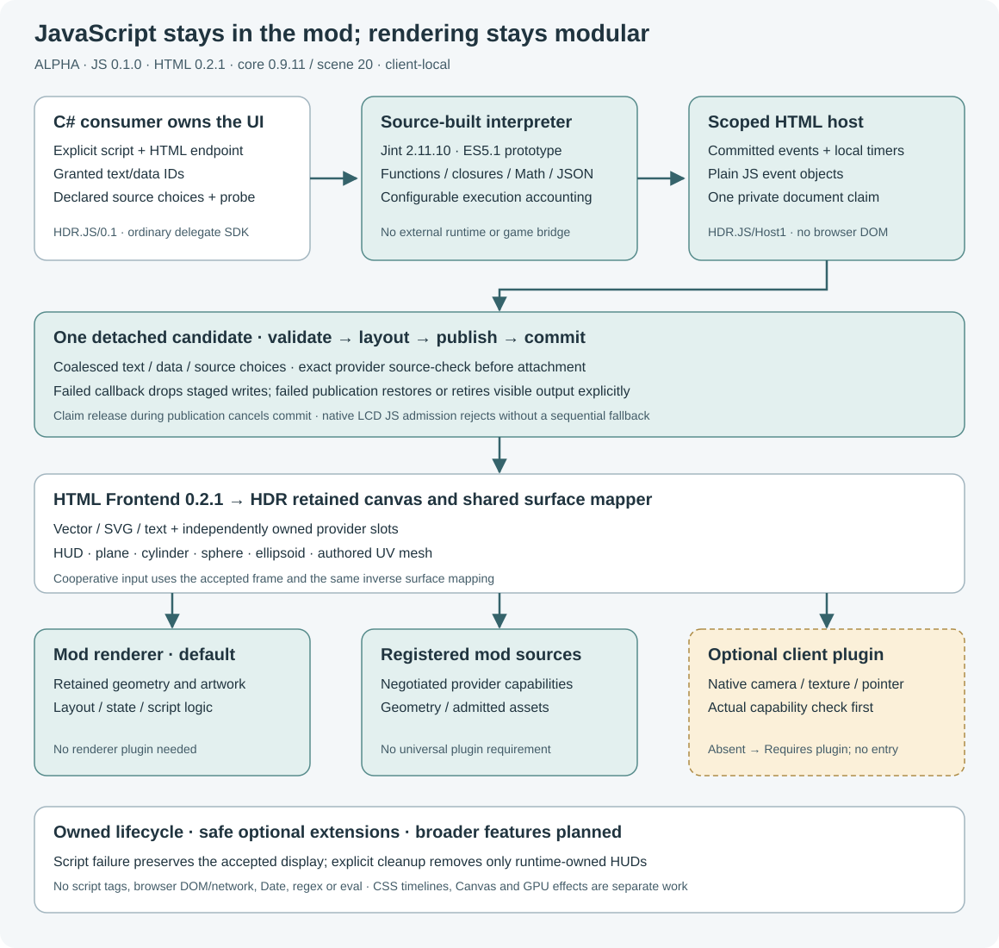

# JavaScript prototype

**ALPHA — JavaScript Runtime 0.1.0 / HTML Frontend 0.2.2 / HDR API 0.9.11 / scene 20.** The JavaScript host requires HTML Frontend **0.2.1 or later**. JavaScript runs in an optional Workshop mod through a source adaptation of Jint 2.11.10. The interpreter and ordinary retained HTML drawing need no client plugin. Native camera/texture/input features keep their independent optional provider requirements; the current native renderer remains **0.9.14**.

This is `HDR.JavaScript/ES5.1-Prototype1` with a small `HDR.JS/Host1` document API, not a browser. Final gate results are recorded separately from this capability description. Live game/GPU/input/multiplayer acceptance remains unverified.



## What runs in the mod

The genuine Jint source port retains variables, functions and closures, object/array operations, Math and JSON paths. The prototype omits Date/local time, regex and regex literals, dynamic `eval`/`Function` construction, CLR interoperability and debugger integration. Modern modules, classes, arrow functions, promises and `async`/`await` are outside this ES5.1 profile. It uses no native JS engine, DLL loader, JIT, renderer hook or sandbox bypass.

The HTML parser still rejects `<script>` and inline `on*` attributes. A C# owner explicitly creates a realm or binds a document and supplies JS source through [`HdrJavaScriptApi`](../../Api/Mods/HdrJavaScriptApi.cs). JS support does not make arbitrary websites or web frameworks work, and it does not add CSS animations, a browser DOM, Canvas or web-resource loading.

## Try the counter

Enable [`HDRJavaScriptRuntime`](../../OptionalMods/HDRJavaScriptRuntime), [`HDRHtmlFrontend`](../../OptionalMods/HDRHtmlFrontend) and core [`Mod`](../../Mod) as separate world mods. The interpreter can run without the display mods; this HUD demo needs HTML Frontend **0.2.1+** and core **0.9.11**. No renderer plugin is needed for this demo.

1. Enter `/hdrjs demo` explicitly to create a vector HUD counter.
2. Enter `/hdrjs click` to deliver an explicit synthetic HTML pointer click. The real committed document event invokes a JS closure, which changes its declared text node.
3. Enter `/hdrjs status` to inspect it, then `/hdrjs clear` to remove the owned demo.

Loading the mod starts no demo and captures no native input. Consumers supply cooperative pointer coordinates/rays from an input session they own. The chat command tests that route; it is not global mouse capture.

## Compose with an existing display

Create HTML through your own [`HdrHtmlApi`](../../Api/Mods/HdrHtmlApi.cs) on a HUD, world plane or [general surface](Display-Surfaces.md), including an ellipsoid. Bind that actual owned endpoint/handle and its generation witness through `HdrJavaScriptApi.BindHtml`, then explicitly grant text-node IDs and data keys.

```javascript
var count = 0;
hdr.on("click", "increment", function(e) {
    count++;
    hdr.setText("count", "Count: " + count);
});
```

`hdr.on` accepts a JS function/closure or a global function name. Function callbacks receive a plain JS object with `type`, `targetId`, `action`, `value` and `revision`; named handlers receive those five scalars. Timers accept the same handler forms. `hdr.setText` and `hdr.setData` update only IDs/keys declared by the C# owner. `data-action` remains descriptive data and never executes a terminal action or PB.

For camera switching, C# declares a finite source choice through `AddSourceChoice` with its actual provider/source/settings and a mandatory capability probe. JS calls `hdr.selectSource("front")`. The host performs the exact read-only `source-check(document,provider,sourceId)` and provider probe before attachment. A negotiated mod-native provider can work without a plugin. An absent native provider returns `false`, prints `Requires plugin: ...` and records the reason in `Diagnostics`; it does not enter `AttachSource` or substitute pixels with sprites.

The host keeps one private `script-claim` on the actual HTML document. Delegating that endpoint through two wrappers does not create two independent JS claims. The token, endpoint and handle stay in C#; JS receives no game objects. Ordinary source frames/camera changes retain layout and control identity.

## Publication and cleanup

Each successful callback coalesces text/data writes and source choices into one retained HTML `mutate` batch. The frontend validates the entire detached candidate, builds one layout and publishes once before committing desired state. Its limit is 64 operations and 131,072 direct string characters; an oversized batch rejects without splitting into partial updates. Releasing the matching script claim during renderer publication prevents the candidate from committing.

A callback error drops unflushed mutations and retires JS/timers/its claim while preserving the last committed HTML frame. A rejected renderer publication restores prior state when confirmed; uncertain restoration retires visible output and input with an explicit status reason. Physical native-LCD JS binding rejects before a claim because atomic publication is unavailable. There is no sequential `DrawFrame` fallback.

Externally bound HTML remains its C# consumer's responsibility. Runtime-created HUDs persist after script errors, then are removed by explicit realm/owner cleanup or unload. `CreateHud` returns a realm; its SDK `Pointer`/`CancelPointer` helpers operate only that current runtime-owned HUD and remain cooperative. Input for an externally bound document stays with the consumer's HTML `Pointer`/`PointerRay` API.

Execution policies are configurable and separate from unlimited-by-default renderer geometry allowances. Interpreter statements/operations, source/depth, object/string growth, allocation accounting, callbacks/events/timers and host work have explicit policies. Allocation units are conservative accounting, not measured CLR heap bytes. Exhausting the cumulative realm allowance requires a new realm. See [exact defaults and zero-disable rules](../../OptionalMods/HDRJavaScriptRuntime/Docs/Mod-API.md#configurable-policies).

## Mod-first expansion plan

The following remains planned unless the current [HTML profile](../../OptionalMods/HDRHtmlFrontend/Docs/Profile.md) explicitly lists it. These rows do not advertise implemented CSS/browser features.

| Feature | Preferred Workshop-mod implementation | Optional plugin extension |
| --- | --- | --- |
| Keyframes, transitions, easing, repeats and pause/resume | Compiled retained timelines; update local properties without reparsing | Cached texture-layer/shader animation |
| Transforms, positioning, grid, fuller flex, variables, `calc()` and responsive rules | Parser/cascade/layout/matrix algorithms with matching clipping and hit-testing | No fundamental dependency |
| Hover/active state, richer controls and DOM-like changes | Owned retained node/state APIs and committed-frame events | Native input/keyboard integration |
| Packaged images, inline SVG and animated atlases | Existing registered materials, authored geometry and changing UVs | Image decode/upload and bitmap layers |
| Rounded clipping, clip paths and gradients | Geometry clipping/tessellation and packaged textures | Shader/stencil/alpha masks |
| Shadows and glows | Geometry/texture approximations or processing owned UI pixels | Efficient blur passes |
| Exact group opacity, filters and blend modes | Software composition of known UI artwork where a supported presentation path exists | Isolated render targets/GPU composition, including camera textures |
| Canvas 2D | Paths/shapes/text/transforms lowered to retained commands | Bitmap targets, pixel operations and uploads |
| Camera/video | Consume an available registered provider through existing source slots | Native capture/media decoding |
| World backdrop blur | Public mod drawing does not expose the scene image to sample | Guarded scene-texture access/filtering |

Exact group opacity is different from fading every overlapping child. CPU pixel processing does not itself give a mod a way to upload arbitrary images or read private camera textures. Missing backend capabilities remain precise admission errors. Renderer plugins stay optional: the parser, layout, state, animation and script logic should remain mod-native wherever practical.

## APIs and licenses

- [Mod SDK](../../OptionalMods/HDRJavaScriptRuntime/Docs/Mod-API.md): `HDR.JS/0.1`, ownership, status, diagnostics and policy settings.
- [Host API](../../OptionalMods/HDRJavaScriptRuntime/Docs/Host-API.md): document events, timers, atomic mutations and source choices.
- [Language profile](../../OptionalMods/HDRJavaScriptRuntime/Docs/Profile.md): deliberate omissions and execution accounting.
- [Provenance](../../OptionalMods/HDRJavaScriptRuntime/ORIGIN.md): pinned source/archive and per-file port mapping.
- [Included notices](../../OptionalMods/HDRJavaScriptRuntime/LICENSES/README.md): exact Jint BSD 2-Clause/credits, Esprima supplement, V8 BSD 3-Clause and MPL 2.0. The covered readable source and notices ship inside the mod.

The PB `HDR.HtmlPB/0.1` adapter remains server-owned and provides no JavaScript execution/replication bridge. Client-local JS does not assign authoritative PB variables, run terminal actions or fetch network resources. A future PB/controller mode needs its own authenticated ownership and event contract.
