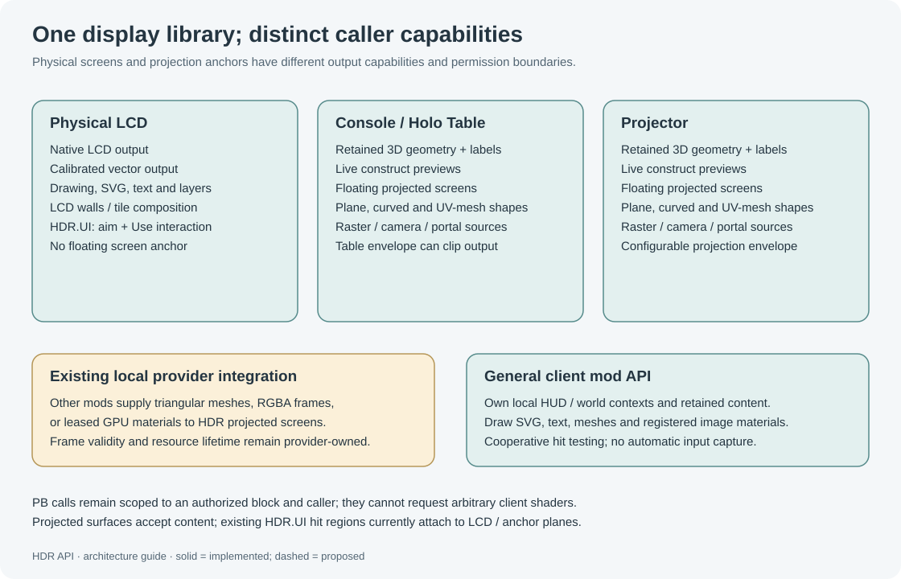

# Programmable blocks

The PB API describes block-bound displays. It does not expose the native renderer, arbitrary camera resources, shaders, pointers, files or executable client callbacks. Mods use a separate integration boundary; see [API boundaries](API-Boundaries.md).

## Block capability matrix



| Capability | Physical LCD (`IMyTextPanel`) | Console (`LargeBlockConsole`, projector family) | Other Projector (`IMyProjector`) |
|---|---|---|---|
| Retained drawing, text, SVG, layers and animations | Flattened to LCD canvas | World-space | World-space |
| Native LCD sprite backend | Yes, with HDR content selected | No | No |
| Calibrated screen-pinned vector backend | Supported exact panel models/rotations; native fallback otherwise | No | No |
| Tiled LCD canvas | Yes | No | No |
| Full live grid/model miniature | No; LCD `live` is simplified bounds | Yes | Yes |
| Virtual plane/curved/mesh screens | No | Yes | Yes |
| Direct camera panorama, provider images, native portal declarations | Through virtual-screen API: unavailable on physical LCD target | Yes | Yes |
| Native look-and-use UI controls | Yes | Yes, on anchor UI plane | Yes, on anchor UI plane |
| Numeric artwork controls | Planar XY paths/local-Z rotation with admitted pose proof | Yes, on world display | Yes, on world display |
| Projected curved-screen widget input | Not applicable | Not implemented | Not implemented |
| Truncated-pyramid table envelope | No | Yes | Requires Console/Holo Table subtype |
| Range envelope | LCD has its own bounds | Yes | Yes |

Embedded text surfaces are not interchangeable with `IMyTextPanel` drawing targets. The background-setting helper accepts a surface index, but this does not add full HDR scene support to every `IMyTextSurfaceProvider`. A block carrying an LCD component can still be a Console anchor.

## Bind the short endpoint

Place this forwarding helper inside the PB's `Program` class:

```csharp
Func<string, object[], object> _draw;
object H(string command, params object[] args)
{
    if (_draw == null)
    {
        var property = Me.GetProperty("HDR.Draw");
        if (property == null) throw new Exception("Enable HDR API and reload the world.");
        _draw = property.As<Func<string, object[], object>>().GetValue(Me);
    }
    return _draw(command, args);
}
```

`H("version")` returns the command interface string `HDR.Draw/1`. This differs from the mod release number, multiplayer scene protocol and client plugin version. Do not parse it as a package version.

The legacy typed helper [HoloMapApi.cs](../../Api/HoloMapApi.cs) binds `HDR.Api`, a read-only dictionary of delegates, and provides typed methods. Its `ApiVersion` identifies the stable delegate contract `HDR.Api/1`; `Version` is the product version. The helper also accepts compatible historical releases when stable contract metadata is absent. The short endpoint is the recommended interface for new PBs; it has the newer screen/camera/portal commands without a large appended class. [PortalApi.cs](../../Api/PortalApi.cs) is a small optional typed wrapper over the short portal commands.

The small modern helper [HdrIngameApi.cs](../../Api/Ingame/HdrIngameApi.cs) provides activation, forwarding, target selection and named structural capability flags. `H("capabilities", optionalBlock)` returns a detached `MyTuple<string,string,int>`: schema `HDR.DisplayCapabilities/1`, kind (`lcd`, `console`, `projector` or `unsupported`) and flags. Omit the block to inspect the selected target. This query does not create a scene or change target selection. Flags are supported=1, native LCD=2, calibrated vector LCD=4, floating 3D=8, table volume=16, projected surfaces=32 and native UI=64. They describe block structure, not which renderer/input plugin a particular viewer has installed.

Exact calibrated-vector eligibility requires locally available model/surface/rotation evidence. A dedicated host can lack that model evidence and report native LCD only; that does not establish that a viewing client lacks vector capability.

## Optional plugin status and recoverable results

`H("plugin-status", feature)` is available before target selection and while a virtual screen is selected. Supported feature IDs are `raster-ui`, `camera-panorama`, `lcd-texture`, `native-portal` and `interactive-pointer`. The result is `MyTuple<bool,bool,string>`: known feature, locally registered component, explanation. A successful query is not the same as `Item2 == true`; registration is not proof of completed GPU capture, exclusive input routing or remote viewers' readiness.

`H("plugin-status", "interactive-pointer")` checks the native PB mouse provider supplied by HDR Client Renderer 0.9.13 or later. Local registration does not establish an actual routed input sample or an admitted viewer/gesture. A dedicated server reports a known feature with local registration false and a viewer-dependency explanation; shared numeric declarations must remain available to clients with the provider.

The modern helper has `TryCall(command, object[] args, out object result, out string reason)`, `TryCapabilities(target, out capabilities, out reason)` and `TryPluginStatus(feature, out status, out reason)`. Expected availability/validation failures return `false` with a printable reason. Its existing `Call` retains throwing validation semantics. Missing optional plugins do not prevent valid camera/portal/raster declarations on the server.

```csharp
// Include HdrIngameApi.cs inside Program.
var hdr = new HdrIngameApi();
if (!hdr.Activate(Me)) { Echo("Requires mod: HDR API."); return; }
VRage.MyTuple<bool,bool,string> status;
string reason;
if (!hdr.TryPluginStatus("camera-panorama", out status, out reason))
    Echo(reason);
else if (!status.Item2)
    Echo(status.Item3);
// Continue declaring the shared display; this query is diagnostic only.
```

Without a viewing client's plugin, its feature stays inactive with a bounded message such as `Requires plugin: HDR Client Renderer (camera images).` A dedicated server instead reports `Viewer-dependent capability: ...`; never gate shared declarations on the server's local plugin status. Other viewers may have the required renderer. Raster UI, camera imagery (including LCD relay) and native portals have three bounded notification categories; reconnect/reset permits a new notice. Core vectors, fixed native look-and-use actions, numeric math and the general mod HUD renderer work without this plugin. Native PB mouse capture additionally requires the optional pointer provider; a cooperating client mod supplies its own input route.

## Numeric controls and script variables

Use [interactive controls](Interactive-Controls.md) to bind an authored drawing item to a ranged, snapped number and a line, polyline or rotation constraint. [InteractiveControlsDemo.cs](../../Examples/InteractiveControlsDemo.cs) is a complete PB example with throttle, trim and angle variables. Declare retained artwork and controls once; assign actual script variables from `get-value` or `poll-value-events`, then use `set-value` with an expected revision for compare-and-set source changes. HDR does not reflect fields by name or invoke arbitrary PB callbacks.

`value-notify` registers a fixed, deferred PB wake argument. The wake carries no value payload; poll the canonical values/events when it runs. Value events have this shape:

```csharp
VRage.MyTuple<string, string, string, VRage.MyTuple<double, long, long>>[]
// kind, controlId, valueId, (canonicalValue, valueRevision, playerId)
```

Events may coalesce. A stale compare-and-set returns the current canonical value and revision without changing them; assign that returned value to the script variable and choose a deliberate retry policy. A source write that is admitted takes authority over an active gesture.

In on-foot, first-person gameplay, **Use** on an authored control hotzone enters its persistent bundle viewer while the artwork stays on the world display. An actual mouse-down begins a value gesture. Mouse-up commits/releases that value gesture while the native cursor and viewer remain; **Escape** or context loss closes the viewer. Hit rectangles follow the item pose and include author-chosen padding, rather than proving pixel/triangle coverage. Physical LCD picking is limited to planar XY paths and local-Z rotation with admitted pose proof; curved/mesh display-surface picking is unavailable. Native PB mouse capture needs the optional pointer provider. Numeric declarations and script writes remain plugin-free. The implementation compiles and passes offline tests; installation and live input behavior still need acceptance.

## Discover and select

| Command | Arguments | Result |
|---|---|---|
| `target` | Exact name (`string`) or PB-compatible terminal block | `true`; selects an authorized display |
| `findtarget` | Exact name | Nearest Console/Projector or `null`; selects it |
| `findtargets` | Exact name | `List<IMyProjector>` on the PB's construct |
| `finddisplay` | Exact name | Nearest Console/Projector/LCD or `null`; selects it |
| `finddisplays` | Exact name | `List<IMyTerminalBlock>` |
| `screen` | Screen ID alone | Select existing virtual screen |
| `screen-target` | Screen ID, or `""` | Select screen, or return to anchor drawing |

Matching discovery uses the caller's construct. Nearest selection resolves equal distances by entity ID. Prefer a block reference or `findtarget` for world-space displays when similarly named LCDs exist. Selecting a new `target` returns drawing to the anchor.

```csharp
var anchor = H("findtarget", "HDR Display") as IMyTerminalBlock;
if (anchor == null) throw new Exception("Name a Console/Projector HDR Display.");
H("screen", "main", MatrixD.CreateTranslation(0, 1.5, 0), 3.2, 1.8);
H("text", "heading", "SYSTEMS", 0, .6, 0, .12, "cyan");
```

## Coordinates, arguments and identity

Geometry uses `Vector3D` model coordinates. At scale 1, one unit is one metre. Anchor local X is right, Y up and Z backward. Geometry transformation order is object transform → shared map view → anchor world transform. `view` changes scale/rotation/offset; line thickness remains in display metres. Rotations are radians; X pitch, Y yaw, Z roll.

Projected screens have an anchor-local rigid pose, physical width/height and a separate centred XY canvas. Canvas Z is flattened for presentation. Surface mapping then turns this flat artwork into the chosen plane, curved surface or authored UV mesh. This is different from the anchor's free 3D object drawing.

Point arguments accept a `Vector3D` or three numbers. Numbers accept `double`, `float`, `int`, `long` and `byte` and must be finite. Paint accepts an RGBA `Vector4` or supported color name/hex string. `H("rgb", 0, 200, 255, .8)` returns normalized `Vector4`; `rgba` accepts normalized components. No automatic string-to-number conversion occurs.

Object IDs are PB-scoped. Different PBs can use the same ID; a PB cannot clear another PB's objects. A replacement retains transform, visibility and layer assignment. Rejected replacement data leaves the previous object intact. Some local compilation failures also preserve the last usable mesh; permission or provider-proof loss must remove unauthorized output instead.

Virtual screens add their own object/layer namespaces. Screen IDs use 1–12 lowercase letters, digits or hyphens. Screen object IDs are at most 32 characters, excluding `!` and `~`; screen layer names are at most 12 characters. Reserved internal screen prefixes are not public IDs.

## Lifetime and re-publication

HDR retains declarations between PB calls. Do not clear and rebuild every simulation tick. Scene definitions are not persisted in the save; run setup after load.

The host/server checks observed callers every 30 simulation ticks. A PB that becomes disabled or stops working retires its owned displays. A changed `ProgramData`, closed/replaced entity or removal also retires its generation. The first write from a changed program detects the change immediately. Retirement removes that PB's screens, objects, labels, layers, UI, animation and tracking; other PBs sharing the anchor keep theirs. Local source leases are released.

Powering the PB back on does not reconstruct its old scene automatically. A script can use a slow setup repair:

```csharp
H("target", anchor);
if (!(bool)H("screen-exists", "main")) SetupDisplay();
```

Keep `anchor` and `SetupDisplay` in your script and revalidate changing source blocks. The maintained camera and portal examples demonstrate this approach. A heartbeat verifies declarations; it does not capture video or upload frames from the PB.

`clear` acts on the selected screen's content when a screen is selected; on the anchor it clears the caller's anchor content. `screen-remove` also removes the selected screen. `lcd-release` releases the selected LCD/group. Terminal background settings changed by `lcd-background` are synchronized block settings and are not automatically restored by scene removal.

## Ownership and server execution

Commands execute on the host/server through a PB. The display must be live, on the PB's mechanical construct and accessible to its owner. Client-side display code receives bounded declarations; dedicated servers do not compile display meshes or run client native captures.

These checks do not sandbox malicious installed mods or prove the origin of every PB delegate reference. Displays and UI definitions are public replicated data. Put no secrets in drawing text, sources or fixed UI arguments. See [Security.md](../../Security.md).
