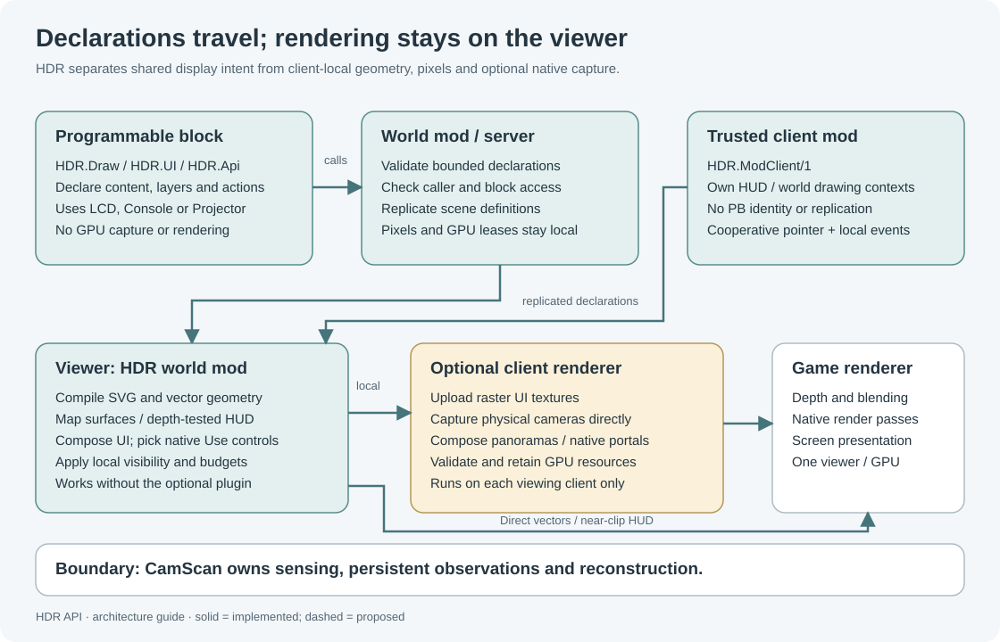

# HDR API wiki

HDR API **0.9.11**, scene protocol **20**, optional Client Renderer **0.9.14**.

> **ALPHA:** Native rendering and input remain experimental. Offline compilation and checks do not establish live GPU, GUI/input or multiplayer acceptance.

Start with the API boundary for your caller. Programmable blocks declare shared displays on blocks; mods can own local HUD/world contexts; source providers supply content; renderer backends own GPU preparation.

## Guides and reference

| Page | Covers |
| --- | --- |
| [Getting started](Getting-Started.md) | Installation, first display and examples |
| [API boundaries](API-Boundaries.md) | Caller scopes, capabilities, ownership and optional plugins |
| [Programmable blocks](Programmable-Blocks.md) | LCD/Projector/Console selection, queries and lifecycle |
| [Drawing](Drawing.md) | Geometry, text, SVG, images, layers, animation and block UI |
| [Hologram effects](Special-Effects.md) | Flicker, refresh bars, depth layers, particles, projector rays and transitions |
| [Interactive controls](Interactive-Controls.md) | Numeric values, line/polyline/rotation constraints, two-way bindings and the persistent bundle viewer |
| [HTML/CSS frontend](HTML-Frontend.md) | Optional plugin-free UI prototype, supported profile, backends and consumer-owned input |
| [Display surfaces](Display-Surfaces.md) | LCD backends, floating/curved/mesh surfaces and raster UI |
| [Cameras and portals](Cameras-and-Portals.md) | Direct camera images, panorama composition and capture shells |
| [Mod integration](Mod-Integration.md) | HUD/menu consumers, source providers and renderer backends |
| [Composition recipes](Composition-Recipes.md) | Complete combinations of data, artwork, surfaces and input |
| [Composition API](Composition.md) | Ordered source slots, curved HTML interfaces and shared surface input |
| [API reference](Api-Reference.md) | Exact versions, message channels, envelopes and command indexes |
| [Performance and troubleshooting](Performance-and-Troubleshooting.md) | Budgets, missing plugins, detail, cadence and diagnostics |

## Choose an example

- **First PB:** [DrawDemo.cs](../../Examples/DrawDemo.cs), generated as `artifacts/DrawDemo.pb.cs`.
- **LCD:** [LcdDemo.cs](../../Examples/LcdDemo.cs).
- **SVG and animation:** [SvgDemo.cs](../../Examples/SvgDemo.cs), [SvgFramesDemo.cs](../../Examples/SvgFramesDemo.cs).
- **Hologram effects:** [HologramEffectsDemo.cs](../../Examples/HologramEffectsDemo.cs), generated as `artifacts/HologramEffectsDemo.pb.cs`.
- **Interactive artwork:** [InteractiveControlsDemo.cs](../../Examples/InteractiveControlsDemo.cs), generated as `artifacts/InteractiveControlsDemo.pb.cs`; native PB mouse requires Client Renderer 0.9.13+.
- **General surfaces:** [GeneralSurfaceDemo.cs](../../Examples/GeneralSurfaceDemo.cs).
- **Direct camera sphere:** [DirectCameraSphereDemo.cs](../../Examples/DirectCameraSphereDemo.cs).
- **Native portal:** [PortalDemo.cs](../../Examples/PortalDemo.cs).
- **HUD/menu mod:** [HudMenuModExample.cs](../../Examples/Mods/HudMenuModExample.cs), with [HdrModApi.cs](../../Api/Mods/HdrModApi.cs).
- **Cooperative mod controls:** [InteractiveControlsModExample.cs](../../Examples/Mods/InteractiveControlsModExample.cs); local getter/setter bindings and consumer-owned input need no client plugin.

See the [categorized examples](../../Examples/README.md) and [contributor/build guide](../Contributing.md). Historical defaults and repairs are kept in the [release history](../../CHANGELOG.md); they are not the current API reference.

## Validation limits

The build checks compile mod/PB/consumer examples against installed game assemblies, exercise ownership and failure paths, and verify renderer ABI/shader paths offline. These checks do not replace live visual/GPU testing or real multiplayer acceptance. Each feature page states its current implementation and limitations.
