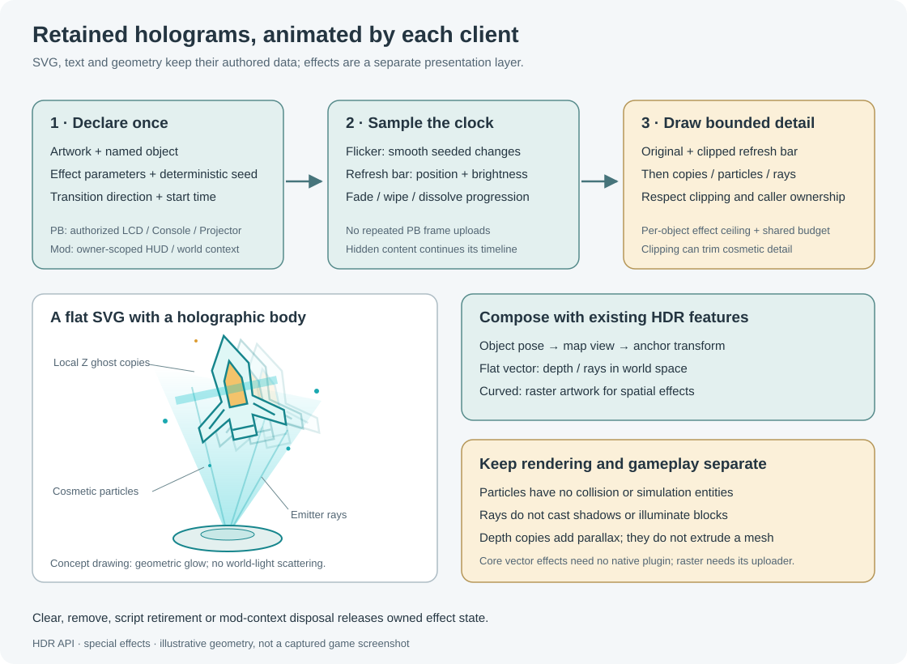

# Hologram effects

HDR API **0.9.8**, scene protocol **18**, adds retained hologram effects to authored drawing objects. Flicker, refresh bars, depth copies, cosmetic particles, projector rays and transitions run on each viewing client. Define their parameters once; a PB does not upload animation frames. Core vector effects work without the optional HDR Client Renderer plugin; raster surfaces retain their existing uploader-plugin requirement.



## Try the complete demonstration

Use [HologramEffectsDemo.cs](../../Examples/HologramEffectsDemo.cs), generated as `artifacts/HologramEffectsDemo.pb.cs`. Name a Console or Projector **HDR Effects** on the PB's construct and run `demo`. The script draws a ship schematic with depth, particles and rays, plus two small instrument panels showing a refresh bar and seeded flicker. `transitionin` and `transitionout` demonstrate dissolve, wipe and fade.

If no matching Console/Projector exists, the example accepts a physical LCD with that name. Select **HDR API** as its Content. This variant omits depth and projector rays and presents the remaining effects on its flat canvas. A Console/Projector takes precedence over a same-named LCD. `off` hides the retained demo, `on` shows it, and `clear` removes its owned content and effect state. Re-run `demo` after a world load or script retirement.

The demo uses a dedicated anchor and changes its drawing view, envelope and shared render budget. Give it its own block rather than sharing an anchor whose placement/envelope another PB manages. It requests the existing defaults of 4,096 points, 8,192 source primitives and 20,000 drawing work units; these are ceilings, not a promise that every viewer spends them.

## Supported presentation paths

| Output | Flicker / refresh / transitions | Particles | Depth / projector rays |
|---|---|---|---|
| PB Console/Projector authored geometry | Yes | Cosmetic quads | Extra local-Z copies and geometric ray strips |
| PB physical LCD | Yes | Flattened cosmetic geometry | Rejected with a printable world-display requirement |
| Flat vector-authored projected screen | Yes | Cosmetic world geometry | Actual screen-normal depth copies and source-local emitter rays |
| Curved/mesh vector-authored projected screen | Flicker, fade and dissolve; scan/spatial wipe require raster artwork | Requires raster artwork | Requires flat vector/world rendering |
| Flat/curved raster-authored projected screen | Yes, through the existing raster uploader | Composed in source space before the surface warp | Rejected; clear volume/rays before switching existing children to raster |
| Mod world context | Yes | Cosmetic geometry | World-space copies and rays |
| Mod HUD context | Yes | Planar cosmetic geometry | Rejected; HUD content must remain planar |

Effects attach to retained drawing meshes: SVG, vector text, lines, polygons and registered-material drawing objects. They are not an effect wrapper for viewer-facing `label` items or the tracked live construct. Camera/portal/provider images do not automatically inherit the effect state of an unrelated drawing object. A projected screen's authored children and its external source are separate paths.

The volume effect repeats the source geometry at small positive and negative local-Z offsets. It adds parallax and a layered glow around flat artwork; it does not build extruded walls, reconstruct a mesh or add lighting to nearby blocks. Projector rays are translucent strips aimed at deterministic source-geometry vertices. The `rays` preset makes them wider and fainter than `beams`. They approximate the visual appearance of light shafts; physical atmospheric godrays, light scattering, shadows and illumination are not implemented by these commands. Particles are procedural drawing geometry with no collisions, physics bodies or simulation entities.

Core effects use the same vector/transparency path as the rest of HDR drawing. LCD sampling cadence, world depth, exposure and bloom still affect their appearance. Requesting a raster/camera/portal feature separately still follows that feature's **Requires plugin: …** guard; adding an effect does not bypass optional-plugin capability checks.

## Commands and exact defaults

Use the `H` forwarding helper from [Programmable blocks](Programmable-Blocks.md#bind-the-short-endpoint). Select a target, define an object, then apply effects to its ID. Different effect types coexist; applying the same type replaces that type's fields while preserving the other settings. Arguments shown after each type are positional.

`H("effect-types")` is a query available before target selection. It returns a detached `string[]` listing `flicker`, `scan`, `volume`, `particles`, `beams`, `rays`, `budget` and `raw`. It lists supported grammar, not the chosen target's dimensional capabilities; the LCD/HUD/raster restrictions above still apply.

| Command | Arguments after object ID | Default and meaning |
|---|---|---|
| `effect` | `"flicker", [strength=.08, hz=12]` | Smooth seeded alpha variation; strength 0 disables it |
| `effect` | `"scan", [strength=.35, hz=.3, width=.04, boost=.5]` | Moving refresh bar; width is a normalized fraction of the object's reveal extent, boost adds RGB brightness inside the bar |
| `effect` | `"volume", [depth=.04, layers=4, falloff=.5]` | Up to four extra source copies; depth is the full nominal local-Z span, successive copies fade by powers of falloff |
| `effect` | `"particles", [count=32, size=.008, speed=.15, lifetime=2, radius=.05, opacity=.5, seed=1]` | Bounded particle slots sampled around source bounds; size/radius/speed use object-local units, lifetime is seconds |
| `effect` | `"beams", [count=8, width=.003, opacity=.3, emitter=Zero, jitter=0]` | Thin emitter-to-element strips; emitter accepts `Vector3D` or three numbers |
| `effect` | `"rays", [count=8, width=.03, opacity=.12, emitter=Zero, jitter=0]` | Wider, fainter projector shafts; shares the beams settings slot |
| `effect` | `"budget", [primitiveLimit=4096]` | Per-object effect-planning ceiling, combined with remaining caller/viewer work |
| `effect` | `"raw", MyTuple<double[],int[]>` | Replace the complete validated numeric descriptor; two separate arrays are also accepted |
| `effect-clear` | `[type]` | Clear one type, or the entire effect descriptor when omitted |
| `effect-settings` | No extra arguments | PB query returns detached `MyTuple<double[],int[]>` arrays |
| `transition` | `"in"` or `"out", [style="fade", seconds=.5]` | Start a fade, wipe or dissolve from the current shared clock |

`effect-clear` types are `flicker`, `scan`, `volume`, `particles`, `beams`, `rays` and `transition`. `beams` and `rays` refer to the same slot. `budget` is not a clearable effect type; set a new limit instead. `transition` requires a direction even when its style and duration use defaults.

```csharp
H("target", "HDR Effects");
H("text", "status", "SYSTEM READY", 0, .3, 0, .1, "cyan");
H("effect", "status", "flicker", .12, 10);
H("effect", "status", "scan", .08, .25, .12, 1.2);
H("effect", "status", "volume", .05, 4, .55);
H("transition", "status", "in", "wipe", .8);
// All four declarations are retained. No Update1 animation loop is needed.
```

Increasing scan `strength` dims the area outside the moving bar; it is not the bar's brightness. Increase `boost` for a bright bar over mostly steady artwork. Scan direction follows the reveal axis, default local Y, with negative `hz` reversing the motion. Zero `hz` holds the seeded bar position. Width 1 covers the whole reveal extent.

Fade changes overall alpha. Wipe selects geometry according to its normalized position along the reveal axis; dissolve selects primitives using stable seeded thresholds. Vector drawing samples effect color on submitted geometry, so a large primitive can change as a unit. The CPU raster compositor interpolates the reveal coordinate at covered samples for its scan/wipe effects; dissolve still follows primitive thresholds. Subdivide authored geometry when a finer vector wipe/dissolve is important. These commands do not introduce an arbitrary per-pixel effect wrapper around an external camera/video feed.

Raster-authored screen children support flicker, scan, particles and transitions. Applying volume/rays there returns `Raster projected artwork supports flicker, scan, particles and transitions; volume and projection rays require flat vector/world rendering.` Clear their `volume` and `beams`/`rays` channels before selecting raster rendering.

Curved/mesh vector artwork supports only scalar flicker, fade and dissolve. Its validation error explains the alternatives: `Curved vector artwork supports flicker, fade and dissolve; use raster artwork for scan, wipe and particles, or flat vector/world rendering for volume and projection rays.` Curved raster artwork applies spatial effects in the original canvas before the warp and therefore needs the existing raster-uploader plugin. Attachment, screen-surface/renderer changes and replicated-state import all enforce these boundaries before accepting state; rejected setup/change leaves the previous admitted scene intact. No source-local curved geometric volume/ray implementation is exposed.

## Typed HDR.Api/1 delegates

The compatible `HDR.Api` terminal property also registers the four delegates below. The stable delegate contract remains **`HDR.Api/1`**; the effect descriptor has its own version **1**, and the product/scene versions are separate. In this table `B` means `Sandbox.ModAPI.Ingame.IMyTerminalBlock`, and `MyTuple` means `VRage.MyTuple`. Arguments begin with the caller PB, authorized display block and caller-owned object ID.

| Dictionary key | Exact delegate type | Behavior |
|---|---|---|
| `SetHologramEffects` | `Func<B,B,string,MyTuple<double[],int[]>,MyTuple<bool,string>>` | Replace the complete validated descriptor |
| `GetHologramEffects` | `Func<B,B,string,MyTuple<double[],int[]>>` | Return detached arrays, or inactive defaults when no effect descriptor exists |
| `ClearHologramEffects` | `Func<B,B,string,MyTuple<bool,string>>` | Clear all effect settings and transition metadata for the item |
| `SetHologramTransition` | `Func<B,B,string,bool,string,double,MyTuple<bool,string>>` | Arguments after ID: entering flag, `fade`/`wipe`/`dissolve`, seconds; retain other effects and stamp the current start time |

The setter/clear results contain success in `Item1` and a printable failure reason in `Item2`. The getter performs the same ownership/target validation and can throw on an invalid call. Only standard arrays, tuples and game block interfaces cross this boundary; no `HologramEffectSettings` or other mod-defined CLR type is exposed. Arrays are validated and copied before retention. Setting the raw descriptor preserves the current transition start/direction; use `SetHologramTransition` to start a transition.

The compatibility [HoloMapApi.cs](../../Api/HoloMapApi.cs) wrapper does not yet provide convenience methods for these four new dictionary entries. The short `HDR.Draw/1` grammar above is preferred for new PB scripts; [HdrIngameApi.cs](../../Api/Ingame/HdrIngameApi.cs) can forward it through its generic `Call`/`TryCall` methods. Advanced consumers using the legacy dictionary must cast to the exact delegate types shown rather than assuming a new helper method exists.

## Coordinates, clips and composition

Effect positions and distances are **object-local, before the object's pose and scale**. At object scale 1, world-context/model units are metres. Thus an SVG authored in a 100-unit viewBox and displayed at scale `.01` also scales a `.1` effect depth to `.001` metres. Author the SVG in model units, or account for that scale when selecting particle sizes, depth and emitter coordinates.

An emitter moves with the object's transform. To keep it at a chosen scene point while moving the object, update its object-local coordinates using the inverse object pose. The demo authors a one-unit SVG at scale 1 and uses a ship-local emitter that maps back to the projection anchor's origin. Effects then follow object transform → map view → anchor transform, just like the source drawing.

The reveal coordinate is the dot product against a normalized local reveal axis, remapped across the source's local bounds. The default is `(0,1,0)`. The raw descriptor can choose another axis and easing. A HUD reveal axis must have zero Z; HUD Y follows the HUD's pixel-coordinate mapping.

A flat vector projected screen maps canvas XY onto its physical plane, then uses a separate screen-normal extrusion direction for depth copies. Its extrusion scale is the geometric mean of the canvas-to-screen X/Y scale factors, preserving nonzero depth even though the base canvas Z is flattened. The emitter remains source-local before the object pose. The physical base screen is still a plane; its cosmetic copies can extend to both sides. Curved vector content accepts scalar effects only; curved raster content composes its supported spatial effects in the source canvas before the chosen surface warp. Raster screens cannot extrude their artwork.

Base source clips and drawing appearance remain separate from effect settings. Extra world particles/rays participate in the display-volume envelope, ordinary depth and transparency; LCD particles participate in LCD clipping. Object opacity, layer opacity and screen-side opacity continue multiplying the result. Emission adds unlit brightness without introducing a world light. Transparency ordering is still the engine's rendering path, rather than browser-style isolated group compositing.

## Clock, lifecycle and ownership

PB effects are replicated numeric declarations with a server-managed animation clock and transition start time. Each client freezes one time sample for the HDR drawing scope, then evaluates deterministic seed/slot/lifetime-cycle samples. There is no mutable random sequence that a PB must advance. The same seed gives reproducible flicker, dissolve thresholds and particle sampling for the same clock and source geometry. The particle command changes the descriptor's shared seed, so it also affects the other seeded effects on that object.

Mod client effects use their local retained-context clock. They are local declarations; your mod must replicate its own scene/effect parameters if other viewers should construct equivalent contexts. See [Mod integration](Mod-Integration.md#runtime-and-replication-matrix).

Hidden objects/layers/contexts stop submitting effect drawing but their effect timeline continues. `visible` is not a pause or restart. The existing `pause`/`resume` commands control ordinary transform animation; they do **not** pause the effect clock. An outgoing transition retains the object and its settings at its hidden final result; use `remove`, `clear` or an incoming transition to manage it afterward. Reissuing `transition` starts a new transition; do not resend it every frame.

Effects do not mutate the retained SVG or source mesh and do not accumulate a trail/history mesh. Removing/clearing an item removes its owned effect state. PB shutdown, program replacement and entity retirement follow the existing caller-generation cleanup; a different PB's effects on the same anchor remain owned by that PB. Mod context destruction, owner release and unload release that owner's effect state. Effect replacement and raw-array input are validated before retention; invalid data leaves the previous admitted settings intact.

## Budgets and supported ranges

The original artwork has priority. Optional drawing is bounded best effort: the ordinary world path first spends work on its clipped refresh-bar overlay, then plans depth copies, particles and beams. Other presentation paths use their own admission/submission costs. The per-object effect ceiling, remaining display/context work and viewer's global HDR work controls all apply. Clipping can add work and trim a depth layer partway through; requested layers are not guaranteed complete. The renderer keeps a deterministic bounded prefix when not all requested extras fit. Setting an effect allowance below source cost suppresses extras rather than removing the canonical source drawing. Effects can still make the source transparent intentionally through flicker/scan/transition.

```csharp
H("budget", 4096, 8192, 20000);  // point / source-primitive / drawing-work ceilings
H("effect", "status", "budget", 4096);
```

Depth copies multiply source cost. A complex SVG with eight copies can be more expensive than a few dozen particles. A particle/beam quad contains two geometric triangles, but geometry counts are not interchangeable with drawing-work units: the ordinary world path charges four units for admission plus submission, the mod path normally charges two triangle units, and a native LCD particle sprite charges one sprite unit. Clipping/tessellation and refresh-band overlays can consume additional work. Raise shared/per-object budgets deliberately and inspect the viewer's `/hdr status` when detail is reduced. Requested counts are not guarantees of visible detail or frame rate. Native LCD refresh rate remains a separate setting.

| Setting | Accepted range |
|---|---|
| Flicker strength / scan strength / falloff / particle opacity / beam opacity / reveal feather | 0–1 |
| Flicker frequency | 0–120 Hz |
| Scan frequency | −20–20 cycles/second |
| Scan width / RGB boost | `.000001`–1 / 0–4 |
| Depth / particle radius / particle speed | 0–1,000 local units |
| Particle lifetime | `.05`–120 seconds |
| Particle size / beam width | `.001`–100 local units |
| Beam endpoint jitter | 0–100 local units |
| Transition duration | 0–120 seconds; zero completes immediately |
| Extra depth layers / particle slots / beam slots | 0–32 / 0–4,096 / 0–2,048 |
| Per-object effect planning ceiling | 0–65,536 primitives |
| Reveal axis / emitter | Finite axis, nonzero; finite emitter within 1,000,000 local units |

These validation bounds protect the declaration format. They do not reserve GPU resources or bypass a lower viewer budget. All numbers must be finite; malformed arrays, unsupported types/targets and out-of-range arguments produce recoverable validation errors.

## Use the effects from another mod

The `HDR.ModClient/1` consumer endpoint uses the same friendly grammar, with its context handle before the object ID. Query `capabilities` for `hologram-effects`, `procedural-particles` and `hologram-transitions`. Define an object in your owner-scoped HUD/world context before applying effects.

```csharp
// _client is the owner endpoint acquired with service("open", ownerId).
// _world is a world-context handle; "emblem" has already been declared there.
_client("effect", new object[] { _world, "emblem", "volume", .06, 4, .55 });
_client("effect", new object[] {
    _world, "emblem", "rays", 12, .02, .1, new Vector3D(0,-1,0), .003
});
_client("transition", new object[] { _world, "emblem", "in", "dissolve", .8 });
// For a HUD context, use flicker/scan/particles/transitions and keep depth planar.
```

The typed [HdrModApi.cs](../../Api/Mods/HdrModApi.cs) helper exposes `Effect(context,id,type,params)`, `Effects(context,id,values,flags)`, `ClearEffects(context,id,type)` and `Transition(context,id,entering,style,seconds)`. Continue following its connection-generation, client-thread and disposal rules. Effect commands do not grant global input capture, world/gameplay actions, arbitrary shaders or native renderer access.

The complete [HologramEffectsModExample.cs](../../Examples/Mods/HologramEffectsModExample.cs) creates a world-space title and a planar HUD status item. Mod world `beams` use camera-facing strips, while `rays` can form a light fan from the emitter and adjacent source vertices. Mod registered-material images retain their UVs for source/depth drawing; decorative strips and particles use a private plain fill material. Reserved `HDR_Client` aliases remain unavailable to general consumers, and effect attachment does not acquire a native source lease. Replacing an item's geometry under the same ID preserves its effect settings; destroying/reopening a context gives a new lifetime.

## Full numeric descriptor

`effect-settings` is a PB query. It returns detached arrays; changing those arrays changes nothing until you submit `effect ... raw`. `raw` replaces all settings, whereas friendly commands merge only their own fields. Both arrays have an exact length and use standard CLR/game types so no mod-defined class crosses into a PB.

| `double[24]` index | Value | Default |
|---|---|---|
| 0, 1 | Flicker strength, Hz | 0, 12 |
| 2, 3, 4, 5 | Scan strength, cycles/sec, width, RGB boost | 0, `.2`, `.05`, 0 |
| 6, 7 | Depth, layer falloff | 0, `.5` |
| 8, 9, 10, 11, 12 | Particle radius, speed, lifetime, size, opacity | `.1`, `.05`, 2, `.02`, `.5` |
| 13, 14, 15 | Beam width, opacity, jitter | `.02`, `.15`, 0 |
| 16, 17 | Transition duration, reveal feather | `.5`, `.05` |
| 18, 19, 20 | Reveal-axis X, Y, Z | 0, 1, 0 |
| 21, 22, 23 | Object-local emitter X, Y, Z | 0, 0, 0 |

| `int[8]` index | Value | Default |
|---|---|---|
| 0 | Descriptor version; must be 1 | 1 |
| 1 | Deterministic signed integer seed | 1 |
| 2, 3, 4 | Extra depth copies, particle slots, beam slots | 0, 0, 0 |
| 5 | Transition: none=0, fade=1, wipe=2, dissolve=3 | 0 |
| 6 | Easing: linear=0, smoothstep=1, cubic ease-in/out=2 | 1 |
| 7 | Effect-planning primitive ceiling | 4,096 |

The inactive raw defaults intentionally differ from some friendly command defaults. For example, a freshly queried descriptor has zero particle slots; calling the friendly `particles` command enables 32 with that command's defaults.

```csharp
var settings = (VRage.MyTuple<double[],int[]>)H("effect-settings", "status");
settings.Item1[18] = 1; settings.Item1[19] = 0; settings.Item1[20] = 0;
settings.Item2[6] = 2; // cubic easing
H("effect", "status", "raw", settings);
H("transition", "status", "in", "wipe", .8);
```

## Validation limits

Offline checks exercise the numeric kernel, deterministic sampling, PB/mod command admission, replication/lifecycle and example compilation. Visual density, transparency ordering, native LCD cadence and GPU frame time still require live-game acceptance. Start with the bounded demo before applying many depth copies to a complex drawing.
